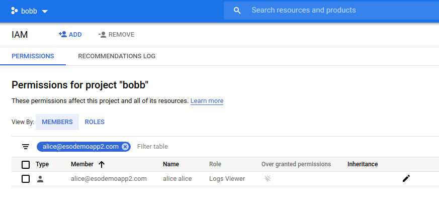
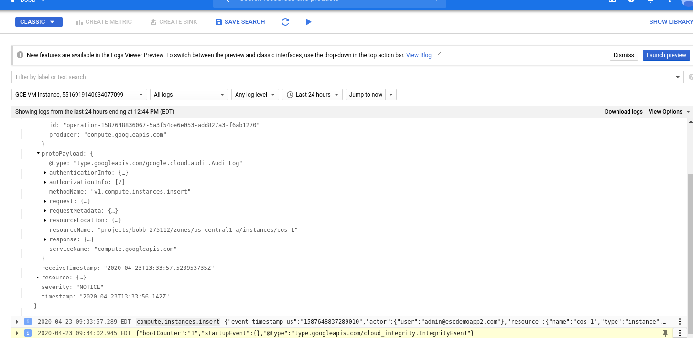
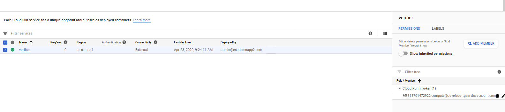

## Remote Authorization and TokenDistributor for GCP VMs

Sample workflow to distribute a secret between two parties where one party directly delivers the secret to a _specific_ virtual machine.  Normally on GCP, one party that owns some data will grant a service account or user permissions to some resource.  The owner of the service account has discretionary power on at that point and can assume the identity of that service account to access the same data.

This flow inverts the access where the data owner shares some secret material that ultimately grants access to their data to a isolated system owned by the remote party  that has been attested by the data owner previously.  This isolated system in this case is a VM that the remote party owns but is configured such that not even the remote party VM owner can access it nor extract the secret that was delivered.

In prose:

* Alice wants to share a file she has on a GCS with a specific VM Bob started.  Alice and Bob do not work in the same company and do not share GCP projects.

Bob Starts a VM
  * Bob's VM runs as `serviceAccount` that has no permissions nor any no ssh access.
  * Bob (user) gives Alice (user) access to read that VM's startup and external runtime metadata
  * Bob can also give Alice access to view Stackdriver Logs for that VM

Alice authorizes her `"TokenDistribution"` service
  * Alice (user) reads the VM's metadata, startup script and notes the `instanceID`, `serviceAccount` and other fields for that VM
  * After Alice (user) is satisfied the VM integrity (i.,e running a known docker container, no ssh access)
  * Alice manages a custom API server `TokenDistribution` that any distributes secrets and tokens to VMs that she authorized
  * Alice adds the serivceAccount and instanceID as "authorized" VMs and are entitled to access a secret which inturn grants access to the file.

Bobs VM contacts "TokenDistribution" service
  * Bobs VM uses its [instance_identity_document](https://cloud.google.com/compute/docs/instances/verifying-instance-identity#verify_signature) as an auth token to call Alice's TokenDistribution endpoint.
  * Alice's verifies the identity document is signed by Google
  * Alice's service checks `instanceID`, `serviceAccount`, `audience` and other claims in the document.
  * Alice's service now knows the VM that contacted it is the VM she authorized earlier.
  * Alice's service can now distribute  credentials back on the API call
  * Bob's service now has credentials to access the secret file

Bobs acquires files
  * Bob's VM now bootstraps a GCS client with those newly acquired credentials and access the files.


The critical thing to note in this flow is the instance identity document provided by a GCE VM is unique:  it cannot be forged anywhere outside of that specific VM.

If Alice is satisfied that the requesting VM is legitimate by inspecting its metadata earlier on (ie, what image is it running, is SSH disabled, etc), then if she gets a request with that document, she knows it must have originated from that same VM.

---

The procedure below is one such setup;

**THIS code is NOT supported by google; its just a sample;  _caveat emptor_**

THis is a trivial protocol that you are free to extend in anyway you want as long as the 'side-channel' verification is present and you make sure the instance identity document can't be forged and reused by Bob.  
You can do that by demonstrating ssh access is disabled.

The protocol is pretty fragile and specific..but the core idea about usign the id_token and JWT verification 

## Setup

Start with two projects where Alice will host the TokenService and the GCS file while Bob will run a VM that needs to prove and acquire a token from Alice's Serivce

* Alice: `alice-275112`
* Bob:  `bobb-275112`

> These steps are best done in _one_ shell since it makes use of env-vars extensively

```bash
gcloud config set project alice-275112 
export ALICE_PROJECT_ID=`gcloud config get-value core/project`
export ALICE_PROJECT_NUMBER=`gcloud projects describe $ALICE_PROJECT_ID --format="value(projectNumber)"`


gcloud config set project bobb-275112 
export BOB_PROJECT_ID=`gcloud config get-value core/project`
export BOB_PROJECT_NUMBER=`gcloud projects describe $BOB_PROJECT_ID --format="value(projectNumber)"`

```
### 1. Bob 

Bob configures his VM to use a NAT (since the VM will not have an external IP)

```bash
cd bob/

gcloud compute routers create nat-router \
    --network default \
    --region us-central1 --project $BOB_PROJECT_ID

gcloud compute routers nats create nat-config \
    --router=nat-router \
    --auto-allocate-nat-external-ips \
    --nat-all-subnet-ip-ranges \
    --enable-logging --region us-central1 --project $BOB_PROJECT_ID

# Create the service account Bob VM will run as. 
# THis service account will have **no** privileges at all;  We will use this to assert the VM's identity only.

# this is the service account bob's VM will initially identify itself as
export BOBS_VM_SERVICE_ACCOUNT=sa-bob@$BOB_PROJECT_ID.iam.gserviceaccount.com

echo $BOBS_VM_SERVICE_ACCOUNT
  sa-bob@bobb-275112.iam.gserviceaccount.com

gcloud iam service-accounts create sa-bob --display-name "Bob Service Account" --project $BOB_PROJECT_ID
```

### 2. Alice

Switch to Alice now and create a service that is intended to get distributed **TO** bob after verification.
This service account does have access to the secret file.

```bash
cd alice/

# This is the service account that will have access to the alices file that she will distribute only to bob's VM later.
export SA_EMAIL_FOR_BOB=sa-for-bob@$ALICE_PROJECT_ID.iam.gserviceaccount.com
echo $SA_EMAIL_FOR_BOB
  sa-for-bob@alice-275017.iam.gserviceaccount.com


# Note the service account that Alice's service runs as.  THis is the default service account Cloud Run 
# This service account is used in verifying the audience field in the inbound id_token (i'll explain later)
export DEFAULT_RUN_SA=$ALICE_PROJECT_NUMBER-compute@developer.gserviceaccount.com
echo $DEFAULT_RUN_SA

# Download a service account key that you will ultimately distribute
# NOTE you should not do this in production; there are plenty of other ways to this step properly
#   eg. Alice's serivce uses Hashicorp Vault; Alice Service generates a service account at runtime; Alices service sends a short-term token 
#   to Bob, etc.   I'm just doing the steps here as a sample

gcloud iam service-accounts create sa-for-bob --display-name "Service Account for Bobs Vm" --project $ALICE_PROJECT_ID
gcloud iam service-accounts keys create sa-for-bob.json --iam-account=$SA_EMAIL_FOR_BOB  --project $ALICE_PROJECT_ID
  created key [f6146640db65db70a766a6f850654fed588859ab] of type [json] as [sa-for-bob.json] for [sa-for-bob@alice-275112.iam.gserviceaccount.com]

# Create a GCS bucket where alice will save the secret files

export SHARED_BUCKET=$ALICE_PROJECT_ID-shared-bucket
gsutil mb -p $ALICE_PROJECT_ID -l US-CENTRAL1 gs://$SHARED_BUCKET  

  Creating gs://alice-275112-shared-bucket/

# Allow the serice account Bob's VM will eventually get access to that bucket
# Again, in production you will probably want to do this 'just in time' and not like this upfront..

gsutil iam ch serviceAccount:$SA_EMAIL_FOR_BOB:objectViewer gs://$SHARED_BUCKET

# create and upload the file
echo "meet me at..." > secret.txt

gsutil cp secret.txt gs://$SHARED_BUCKET/
```

Alice Deploys the TokenService

```bash
cd app/

gcloud services enable containerregistry.googleapis.com secretmanager.googleapis.com --project $ALICE_PROJECT_ID

docker build -t gcr.io/$ALICE_PROJECT_ID/alicesapp .
docker push gcr.io/$ALICE_PROJECT_ID/alicesapp

# We will now deploy a _staging_ version of alice's token service
#  we're only doing this as a consequence of how this app is structured:  Alice's app uses some environment variabes
# it only knows about later..i know, this is a bit lazy and i can ofcourse improve on this...

export BOBS_VM_ID="temp"
export VERIFIER_AUDIENCE="temp"

gcloud run deploy verifier --image gcr.io/$ALICE_PROJECT_ID/alicesapp \
   --update-env-vars VERIFIER_AUDIENCE=$VERIFIER_AUDIENCE,BOBS_VM_SERVICE_ACCOUNT=$BOBS_VM_SERVICE_ACCOUNT,ALICE_PROJECT_ID=$ALICE_PROJECT_ID --project $ALICE_PROJECT_ID

#   for now, (note we are not really allowing unauthenticated invocations since we check access at the api layer..but we'll come back to this in the "Enhancements" section below)

#      Allow unauthenticated invocations to [verifier] (y/N)?  y  <<
#	 Service [verifier] revision [verifier-00001-ziw] has been deployed and is serving 100 percent of traffic at https://verifier-nvm6vsykba-uc.a.run.app 

# Note the endpoint for Alice's Tokens Service: 

export VERIFICATION_ENDPOINT=https://verifier-nvm6vsykba-uc.a.run.app 

# try an endpoint that doens't ask for proof the request is from Bobs VM

$ curl $VERIFICATION_ENDPOINT
ok

# and one that does
$ curl $VERIFICATION_ENDPOINT/verify
:(

```

### 3. Bob

Bob Deploy VM 

```bash
cd ../../bob/

# Edit `app/server.go`, change it to the value of `$VERIFICATION_ENDPOINT` and `$SHARED_BUCKET`
# in my case they were:
```

```golang
	targetAudience = "https://verifier-nvm6vsykba-uc.a.run.app"  
	url            = "https://verifier-nvm6vsykba-uc.a.run.app/verify"
	bucketName = "$ALICE_PROJECT_ID-shared-bucket"
	objectName = "secret.txt"	
```


Now build a container image.  This container image is what ALice verifies is running on Bob's VM.  Alice will only grant access if
she sees that this VM is running w/o SSH access and something with this specific hash.

This container image does nothing special:  its a simple http server that when it receives a request will attempt to call the
TokenService using its identity token.  If it gets a token back from Alice's service (who at that point is happy with the work Bob did),
that token can be used to access the secret file

```bash
gcloud services enable containerregistry.googleapis.com --project $BOB_PROJECT_ID

cd app
  docker build -t gcr.io/$BOB_PROJECT_ID/bobsapp .
  docker push gcr.io/$BOB_PROJECT_ID/bobsapp


# Note the image hash
$ docker push gcr.io/$BOB_PROJECT_ID/bobsapp
      latest: digest: sha256:51ee3d987db860f6aa543c3d6a995b856feb2bdb78f0999b5e770277f2d495a2 size: 949

export VALIDATED_IMAGE=gcr.io/$BOB_PROJECT_ID/bobsapp@sha256:51ee3d987db860f6aa543c3d6a995b856feb2bdb78f0999b5e770277f2d495a2
echo $VALIDATED_IMAGE
```

Edit the VM Container Init script and enter the value of `$VALIDATED_IMAGE`

edit `bob-init.yaml`
```yaml
    ExecStart=/usr/bin/docker run --rm -u 2000 --name=mycloudservice gcr.io/bobb-275112/bobsapp@sha256:51ee3d987db860f6aa543c3d6a995b856feb2bdb78f0999b5e770277f2d495a2
```

Open a firewall to all you to test if this whole thing even works:  Bob's container runs a simple http sever which

Allow  http access to Bob's server and deploy the VM

```bash
gcloud compute  firewall-rules create firewall-rules-bob --allow=tcp:8080 --source-ranges=0.0.0.0/0  --target-tags=bob --project $BOB_PROJECT_ID

cd ../
export BOBS_VM_DEFAULT_SERVICE_ACCOUNT=$BOB_PROJECT_NUMBER-compute@developer.gserviceaccount.com

gcloud compute instances create cos-1   --image-family cos-stable     --image-project cos-cloud \
     --zone us-central1-a --service-account=$BOBS_VM_DEFAULT_SERVICE_ACCOUNT \
     --scopes=userinfo-email,storage-ro  --tags=bob --machine-type n1-standard-1 \
     --metadata-from-file user-data=bob-init.yaml   --project $BOB_PROJECT_ID
```

We are far from done.  We need to find out what the unique `vm_id` is as well as let Alice's TokenService know about it.

We also need to allow alice's (User) command line ability to inspect the VM's metadata

```bash

# Find Bob's server external address and instanceID

export BOBS_SERVER=`gcloud compute instances describe cos-1 --project $BOB_PROJECT_ID --format="value(networkInterfaces[0].accessConfigs.natIP)"`
export BOBS_INSTANCE_1_ID=`gcloud compute instances describe cos-1 --format="value(id)" --project $BOB_PROJECT_ID`

echo $BOBS_SERVER
echo $BOBS_INSTANCE_1_ID

# in my case they were:
# 34.71.31.232
# 1079298362778070454

# no grant a **User** in alice's company ability to inspect the VM
gcloud compute instances add-iam-policy-binding  cos-1 --member=user:alice@esodemoapp2.com --role roles/compute.viewer --project $BOB_PROJECT_ID
```

### 4. Alice (user), verifies Bob's VM state

Note at this point, `alice@esodemoapp2.com` can verify by looking at

* VM's metadata
* VM logs

#### Verify metadata

```bash
gcloud config set account alice@esodemoapp2.com
gcloud compute instances describe cos-1 --project $BOB_PROJECT_ID
```

She notes the following bit of metadata:

* confirms the serviceAccount: `313701472922-compute@developer.gserviceaccount.com`
  The inbound service account's JWT token to Alice's Service **must be for this service account**

* confirms the `vm_id`: `5516919140634077099`
  Alice will later use a [Secret Manager](https://cloud.google.com/solutions/secrets-management) to save some key material
  associated with this id.  That is, the aes key Alice's service will send back to this VM is saved in secret manager as:
  `aes-5516919140634077099` and RSA is `rsa-5516919140634077099`

* confirms the init script is running the image hash:
  `gcr.io/$BOB_PROJECT_ID/bobsapp@sha256:51ee3d987db860f6aa543c3d6a995b856feb2bdb78f0999b5e770277f2d495a2`

* confirms no ssh access is possible:
  `iptables -D INPUT -p tcp -m tcp --dport 22 -j ACCEPT`    

```yaml
$ gcloud compute instances describe cos-1 --project $BOB_PROJECT_ID
    cpuPlatform: Intel Haswell
    creationTimestamp: '2020-04-23T06:33:57.037-07:00'
    id: '5516919140634077099'
    kind: compute#instance

    metadata:
      items:
      - key: user-data
        value: |-
          #cloud-config

          users:
          - name: cloudservice
            uid: 2000

          write_files:
          - path: /etc/systemd/system/cloudservice.service
            permissions: 0644
            owner: root
            content: |
              [Unit]
              Description=Start a simple docker container
              Wants=gcr-online.target
              After=gcr-online.target

              [Service]
              Environment="HOME=/home/cloudservice"
              ExecStartPre=/usr/bin/docker-credential-gcr configure-docker
              ExecStart=/usr/bin/docker run --rm -u 2000 -p 8080:8080 --name=mycloudservice gcr.io/$BOB_PROJECT_ID/bobsapp@sha256:51ee3d987db860f6aa543c3d6a995b856feb2bdb78f0999b5e770277f2d495a2
              ExecStop=/usr/bin/docker stop mycloudservice
              ExecStopPost=/usr/bin/docker rm mycloudservice

          runcmd:
          - iptables -D INPUT -p tcp -m tcp --dport 22 -j ACCEPT   
          - systemctl daemon-reload
          - systemctl start cloudservice.service
      kind: compute#metadata

    serviceAccounts:
    - email: 313701472922-compute@developer.gserviceaccount.com
```

#### Verify Logging

Bob can also grant ALice the IAM ability to view the audit logs for the VM on his project. 

Todo this, BOb grants the `logging.Viewer` role to his project.  (note: the logging viewer allows inspection of all logs in that project; not just the VM)



Once thats one, Alice can directly view logs on the target project




### 4. Alice

Alice is now satisfied that the VM is in a correct state and will authorize that `vmID` access to the secret.

```bash
# switch to ALice's home directory

cd alice/

# Convert the private key to base64 and verify you still have the env-vars set

base64 sa-for-bob.json | tr -d '\n\r' >sa-for-bob.json.b64

export DEFAULT_RUN_SA=$ALICE_PROJECT_NUMBER-compute@developer.gserviceaccount.com
echo $BOBS_INSTANCE_1_ID
echo $DEFAULT_RUN_SA

# In my case they were
# 1079298362778070454
# 291362580151-compute@developer.gserviceaccount.com

# Alice uses Cloud Secrets to save a symmetric key and the actual service account private key.
# Alice will authorize sher token service access to these secrets

export AES_KEY_FOR_INSTANCE_1="somesecret"
echo -n $AES_KEY_FOR_INSTANCE_1 | gcloud beta secrets create aes-$BOBS_INSTANCE_1_ID --replication-policy=automatic   --project $ALICE_PROJECT_ID --data-file=-
gcloud beta secrets create rsa-$BOBS_INSTANCE_1_ID --replication-policy=automatic --data-file=sa-for-bob.json.b64 --project $ALICE_PROJECT_ID

gcloud beta secrets add-iam-policy-binding aes-$BOBS_INSTANCE_1_ID --member=serviceAccount:$DEFAULT_RUN_SA --role=roles/secretmanager.secretAccessor  --project $ALICE_PROJECT_ID -q
gcloud beta secrets add-iam-policy-binding rsa-$BOBS_INSTANCE_1_ID --member=serviceAccount:$DEFAULT_RUN_SA --role=roles/secretmanager.secretAccessor  --project $ALICE_PROJECT_ID -q

## The two secrets are formated like this:
#  AESKeyName:    aes-<vm_instance_id>
#  RSAKeyName:    rsa-<vm_instance_id>

# Once Alice's service authenticates the inbound API call from Bob's VM, it will validate the JWT and then use
# the secrets API using the instanceiD in the name
# This way, you can have unique secrets per instance

# Redeploy Alice's app again and this time provide some more env vars that was left out earlier (i.,e the audience field for 'itself')
export VERIFICATION_ENDPOINT=https://verifier-nvm6vsykba-uc.a.run.app 

gcloud run deploy verifier --image gcr.io/$ALICE_PROJECT_ID/alicesapp \
   --update-env-vars VERIFIER_AUDIENCE=$VERIFICATION_ENDPOINT,BOBS_VM_SERVICE_ACCOUNT=$BOBS_VM_SERVICE_ACCOUNT  --project $ALICE_PROJECT_ID
```

### 5. Bob

Access Bobs webserver:

```bash
$ curl -s http://$BOBS_SERVER:8080/
:) AES Key [somesecret]       GCS Data [meet me at...]
```

Bobs server sent its instanceid do to alice's Token Endpoint which recognized Bob's VMID.

Alices service sent back a symmetric key `somesecret` and actual private key material that has access to this Alices' files.


### 6. Bob

Bob wants to start a new VM image but with the same service account.

Thats fine but this protocol used vm_id specific secrets.  You need to reassign secrets to the new vm_id

- as Bob
```bash
gcloud compute instances create cos-1   --image-family cos-stable     --image-project cos-cloud \
     --zone us-central1-a --service-account=$BOBS_VM_DEFAULT_SERVICE_ACCOUNT \
     --scopes=userinfo-email,storage-ro  --tags=bob --machine-type n1-standard-1 \
     --metadata-from-file user-data=bob-init.yaml   --project $BOB_PROJECT_ID


export BOBS_SERVER=`gcloud compute instances describe cos-1 --project $BOB_PROJECT_ID --format="value(networkInterfaces[0].accessConfigs.natIP)"`
export BOBS_INSTANCE_1_ID=`gcloud compute instances describe cos-1 --format="value(id)" --project $BOB_PROJECT_ID`

echo $BOBS_SERVER
echo $BOBS_INSTANCE_1_ID
# 34.71.31.232
# 5516919140634077099

gcloud compute instances add-iam-policy-binding  cos-1 --member=user:alice@esodemoapp2.com --role roles/compute.viewer --project $BOB_PROJECT_ID
```

- Bob tells Alice about the new instanceID value 
- Alice inspects the vm using 
  gcloud compute instances describe cos-1 --format="value(id)" --project $BOB_PROJECT_ID

- as Alice grants the new vmID access to secrets
```
export AES_KEY_FOR_INSTANCE_1="somesecret"
echo -n $AES_KEY_FOR_INSTANCE_1 | gcloud beta secrets create aes-$BOBS_INSTANCE_1_ID --replication-policy=automatic   --project $ALICE_PROJECT_ID --data-file=-

gcloud beta secrets create rsa-$BOBS_INSTANCE_1_ID --replication-policy=automatic --data-file=sa-for-bob.json.b64 --project $ALICE_PROJECT_ID

gcloud beta secrets add-iam-policy-binding aes-$BOBS_INSTANCE_1_ID --member=serviceAccount:$DEFAULT_RUN_SA --role=roles/secretmanager.secretAccessor  --project $ALICE_PROJECT_ID -q
gcloud beta secrets add-iam-policy-binding rsa-$BOBS_INSTANCE_1_ID --member=serviceAccount:$DEFAULT_RUN_SA --role=roles/secretmanager.secretAccessor  --project $ALICE_PROJECT_ID -q

```
- as Bob

Access VM's endpoint

```
$ curl -s http://$BOBS_SERVER:8080/
:) AES Key [somesecret]       GCS Data [meet me at...]
```

---

## Appendix

### Not externalIP
  Bob can also start  the VM without an external IP using the `--no-network` flag but it makes this tutorial much more complicated to 'invoke' Bob's VM to fetch secrets...I just left it out.


- `cos-init.yaml`
```yaml
#cloud-config

users:
- name: cloudservice
  uid: 2000

write_files:
- path: /etc/systemd/system/cloudservice.service
  permissions: 0644
  owner: root
  content: |
    [Unit]
    Description=Start a simple docker container
    Wants=gcr-online.target
    After=gcr-online.target

    [Service]
    Environment="HOME=/home/cloudservice"
    ExecStartPre=/usr/bin/docker-credential-gcr configure-docker
    ExecStart=/usr/bin/docker run --rm -u 2000 -p 8080:8080 --name=mycloudservice gcr.io/$BOB_PROJECT_ID/bobsapp@sha256:51ee3d987db860f6aa543c3d6a995b856feb2bdb78f0999b5e770277f2d495a2
    ExecStop=/usr/bin/docker stop mycloudservice
    ExecStopPost=/usr/bin/docker rm mycloudservice

runcmd:
- iptables -D INPUT -p tcp -m tcp --dport 22 -j ACCEPT   
- systemctl daemon-reload
- systemctl start cloudservice.service
```


## Enhancements

Further enhancements can be to use 
* [VPC-SC](https://cloud.google.com/vpc-service-controls):  This will ensure only requests originating from whitelisted projects and origin IPs are allowed API access to Alices GCS objects.  However, cross-orginzation VPC-SC isn't something i think is possible at the mment.  If Bob sets up a NAT egress endpoint, Alice can define a VPC prerimeter to include that egress
* [Organizational Policy](https://cloud.google.com/resource-manager/docs/organization-policy/org-policy-constraints): Bob's orgianzation can have restrictions on the type of VM and specifications Bob can start (eg, ShieldedVM, OSLogin).  

* `IAM Tuning`: You can tune the access on both Alice and Bob side further using the IAM controls available.  For more information, see [this repo](https://github.com/salrashid123/restricted_security_gce)

* TPM-based keys:  You can also transmit TPM encrypted data.  However, that requires a lot of other tooling and complexity.  For that see [https://github.com/salrashid123/tpm_key_distribution](https://github.com/salrashid123/tpm_key_distribution)

* [Cloud Run Authentication](https://cloud.google.com/run/docs/authenticating/service-to-service).  Since Alice deployed the service to Cloud Run, she can use GCP itself to restrict access to the specific servcie account Bob's VM runs as:
  In the following, we only allow an id_token that is owned by `313701472922-compute@developer.gserviceaccount.com` through. 
  
  Cloud Run will check the audience claim but will ofcourse do nothing to validate the instanceID, etc. You should doublecheck in your app always.

* [IAM Conditions](https://cloud.google.com/iam/docs/conditions-overview):  You can enable IAM conditions on any of the GCP resources in question. Since Alice and Bob are using GCP, you can place a condition on when the TokenService or on the GCS bucket or on Alice's ability to view the VM or logging metadata.


## EndToEnd Encryption
  
  The reason the protocol shows both AES and RSA keys is you an use both to achieve end-to-end encryption.
  
  For example, 
  * Encrypt the GCS file with AES key:
    the data that Alice has on the GCS bucket can be wrapped with an AES key on top of what Google Provides.
    Even if anyone got hold of the secret file, it would be encrypted anyway.  Bob can only decrypt it if he gets the AES key.
    You can go further with this and distribute keys that are infact part of [Shamirs Secret Sharing](https://en.wikipedia.org/wiki/Shamir%27s_Secret_Sharing)
    
  * Mount Persistent Disk with LUKS encryption:
    - [https://github.com/salrashid123/gcp_luks_csek_disks](https://github.com/salrashid123/gcp_luks_csek_disks)
    
