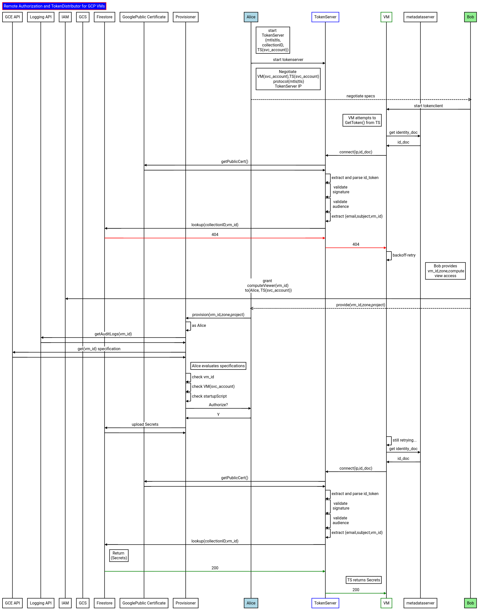
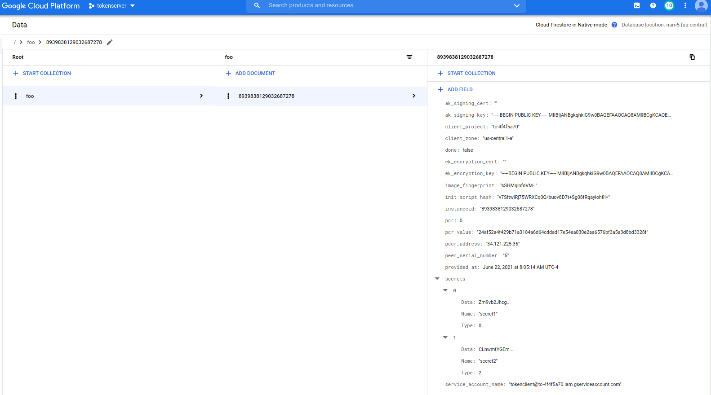

## Remote Authorization and TokenDistributor for GCP VMs

Sample workflow to distribute a secret between two parties where one party directly delivers the secret to a _specific_, deprivileged virtual machine on GCP.  Normally when two parties want to share some data, one party grants IAM permissions on that resource to an identity owned by the other.  That is, if Alice wants to share data with a VM Bob owns,  Alice will grant IAM permissions on some data with the ServiceAccount Bob's VM runs as.  However, Bob essentially has indirect rights on that data simply by assuming the identity of the service account or by simply ssh into that VM and acquiring the service account credentials.  

This is problematic in some situations where Alice would like Bob's VM to process data in isolation but not alow Bob himself from acquiring that data and exfilterating.

The flow described in this repo flow inverts the access where the data owner (Alice) shares some secret material with permissions to sensitive data but **ONLY** to a isolated system owned by Bob.  The data owner (Alice) will share access _exclusively__ to the VM only after attesting some known binary that Alice is aware of and trusts is running on that VM and that that Bob cannot access the VM via SSH or any other means.

In prose:

Alice wants to share a file she has on a GCS with a specific VM Bob started.  Alice and Bob do not work in the same company and do not share GCP projects.

Alice creates a GCP `projectA`
Bob creates a GCP `projectB`

Alice creates creates a VM (`VM-A`) with  `serviceAccountA` and public ip_address `ip-A`
Bob creates creates a VM (`VM-B`) with `serviceAccountB`.

Bob and Alice exchange information offline about `ip-A`, `serviceAccountA` and `serviceAccountB` each party uses

Bob grants Alice and `serviceAccountA` permissions to read GCE startup script and metadata for `VM-A`

`VM-A` runs a `TokenService` that functions to validate and return authorized token requests from `VM-B` 

`VM-B` starts and attempts to contact `ip-A` and acquire the secret from the `TokenService`.

`TokenService` is not yet authorized for to give any token for `serviceAccountB` or `VM-B` and does not return a token.

Alice (offline) runs a `Provisioning` application which:
  
Reads `VM-B` startup script data
  
Validates that `VM-B` has been deprivileged (no ssh access)

Validates the docker image running on `VM-B` is known image hash and trusted by Alice) 

Provisioning Server creates `RSAKey-A`, `AESKey-A`.   RSAKeyA maybe a GCP ServiceAccount Key.

Provisioning Server uses `VM-A`'s TPM based data to seal RSA and AES key.

Provisioning server encrypts RSA and AES key with `VM-B` TPM.

Provisioning Server generates hash of `VM-B` startup script that includes commands to prevent SSH and `docker run` command for the trusted image image.

Provisioning Server saves encrypted RSA/AES keys, hash of startupscript to Google FireStore using the `instance_id` for `VM-B` as the primary key
  

`VM-B` contacts `TokenService`

`VM-B` uses its [instance_identity_document](https://cloud.google.com/compute/docs/instances/verifying-instance-identity#verify_signature) as an auth token to call `VM-A`

`VM-A` verifies the `identity document` is signed by Google

`VM-A` checks `instanceID`, `serviceAccount`, `audience` and other claims in the document.


`VM-A` looks up Firestore using the `instanceID` as  the key.

`VM-A` uses GCP Compute API to retrieve the current/active startup script for `VM-B`

`VM-A` compares the hash of the retrieved startup script against the value in Firestore previously authorized.  If mismatch, return error.

`VM-A` returns encrypted RSA/AES key to `VM-B`

`VM-B` uses its TPM to decrypt RSA and AES key

If RSA key is a GCP Service Account, use that to download data from Google Services.  
The AES/RSA key can be from any provider  (AWS/Azure, etc) or really any arbitrary secret



---

### Setup

This repo will configure the full TokenService infrastructure and Service:

1. Alice will use Terraform to create new GCP Project
2. Bob will Terraform to create new GCP Project
3. Alice and Bob will exchange specifications of ServiceAccounts and IP address of TokenService
5. Alice will use Terraform to create TokenServer
6. Bob will use Terraform to create TokenClient
7. Alice will use `Provisioning` application to authorize Bob's VM and ServiceAccount.
8. TokenServer will return secret to TokenClient

  *It is expected customers will customize the client and server to suite their needs.*

Alice and Bob will both need:

* [terraform](terraform.io)
* `go 1.14`
* Permissions to create GCP Projects
* `gcloud` CLI

### Start TokenServer Infrastructure (Alice)

As Alice, you will need your

*  [Billing Account ID](https://cloud.google.com/billing/docs/how-to/manage-billing-account) 
  `gcloud beta billing accounts list`

* OrganizationID
  `gcloud organzations list`
  If you do not have an organization, edit `alice/main.tf` and remove the `org_id` variable from `google_project`
 
Alice should also login to local gcloud for both cli and application-default credentials sources

```bash
gcloud auth login
gcloud auth application-default login
```

```bash
cd alice/
export TF_VAR_org_id=673208782222
export TF_VAR_billing_account=000C16-9779B5-12345

terraform apply --target=module.setup 
```

You should see the new project details and IP address allocated/assigned for the `TokenServer`

```bash
      Outputs:

      gcr_id = artifacts.ts-a7c2b080.appspot.com
      natip_address = 35.223.60.4
      project_id = ts-a7c2b080
      project_number = 847928479885
      ts_address = 34.70.21.17
      ts_service_account = tokenserver@ts-a7c2b080.iam.gserviceaccount.com


export TF_VAR_project_id=ts-a7c2b080
```

**Provide Bob the values of `ts_address` and `ts_service_account` variables anytime later**

```bash
export TF_VAR_ts_service_account=tokenserver@ts-a7c2b080.iam.gserviceaccount.com
export TF_VAR_ts_address=34.70.21.17
```

### Start TokenClient Infrastructure (Bob)

As Bob, you will need your

*  [Billing Account ID](https://cloud.google.com/billing/docs/how-to/manage-billing-account) 

* OrganizationID
  `gcloud organzations list`
  If you do not have an organization, edit `alice/main.tf` and remove the `org_id` variable from `google_project`
 
The following will startup Bobs infrastructure (GCP project, and allocate IP for tokenClient).

This step can be done independently of Alice at anytime.


```bash
cd bob/
export TF_VAR_org_id=111108786098
export TF_VAR_billing_account=22121-9779B5-30076F


terraform apply --target=module.setup 
```

The command will create a new GCP project, enable GCP api services, create a service account for the Token server and allocate a static IP:

```bash
        Outputs:

        gcr_id = artifacts.tc-d151585d.appspot.com
        natip_address = 104.197.93.80
        project_id = tc-d151585d
        project_number = 461150660741
        tc_address = 34.72.193.13
        tc_service_account = tokenclient@tc-d151585d.iam.gserviceaccount.com


export TF_VAR_project_id=tc-d151585d
```

### Deploy TokenServer (Alice)

As Alice, build the TokenServer and push to Google Container Registry

```bash
echo $TF_VAR_project_id

terraform apply --target=module.build
```

Then deploy it to a VM

```bash
terraform apply --target=module.deploy
```
You should see an output like:

```bash
        Outputs:

        gcr_id = artifacts.ts-a7c2b080.appspot.com
        image_hash = sha256:e65777ab8016346169c63b444287952f0b43e71717d67eb9af971a9b5bb1ec2a
        natip_address = 35.223.60.4
        project_id = ts-a7c2b080
        project_number = 847928479885
        token_server_instance_id = 485890575766587729
        ts_address = 34.70.21.17
        ts_service_account = tokenserver@ts-a7c2b080.iam.gserviceaccount.com
```

### Deploy TokenClient (Bob)

Bob will now deploy the TokenClient

Bob needs to set some additional environment variables that were *provided by Alice* earlier:

* `TF_VAR_ts_service_account`:  this is the service account Alice is using for the TokenServer (`tokenserver@ts-039e6b6a.iam.gserviceaccount.com`)
* `TF_VAR_ts_address`: this is the IP address of the TokenServer (`34.72.145.220`)
* `TF_VAR_ts_provisioner`: this is Alice's email address that Bob will authorize to read the TokenClients metadata values (`alice@esodemoapp2.com`)

Make sure the env vars are set (`TF_VAR_project_id` would be the the TokenClient (Bob) project)

```bash
echo $TF_VAR_ts_service_account
echo $TF_VAR_ts_address
echo $TF_VAR_ts_provisioner

echo $TF_VAR_project_id
```

then build the app

```bash
terraform apply --target=module.build
```

Then deploy it to a VM

```bash
terraform apply --target=module.deploy
```

You should see an output like:

```bash
        Outputs:

        gcr_id = artifacts.tc-d151585d.appspot.com
        image_hash = sha256:3b83f5306f3572576ee3dd65fdb778cc606bc07e282cd7adb9ce2e16fc4ac1f7
        natip_address = 104.197.93.80
        project_id = tc-d151585d
        project_number = 461150660741
        tc_address = 34.72.193.13
        tc_service_account = tokenclient@tc-d151585d.iam.gserviceaccount.com
        token_client_instance_id = 9005331281126819222

```

Note the `token_client_instance_id`.  


### Interlude

At this point the TokenClient and Server have started communicating but every request for a new token would fail since Alice hasn't yet vetted the integrity of the TokenServer:

You can see this in the logs

The tokenClient will attempt to contact tokenServer.  Since no vmID is provisioned, the tokenserver will respond w/ error

- TokenServer


- TokenClient


So...now 

>> **Provide token_client_instance_id to TokenServer Provisioning admin (Alice) so it can be provisioned**

Optionally provide `tc_address` to TokenServer (to apply on-demand firewall or origin checks if NAT isn't used)


### Provision TokenClient vm_id

Use `vm_id` to provision the Firestore Database after validating Bob's VM state

As Alice, 
```bash
cd app/

export TOKEN_SERVER_PROJECT=ts-a7c2b080
export TOKEN_CLIENT_PROJECT=tc-d151585d
export VM_ID=9005331281126819222

$ go run src/provisioner/provisioner.go --fireStoreProjectId $TOKEN_SERVER_PROJECT --firestoreCollectionName foo     --clientProjectId $TOKEN_CLIENT_PROJECT --clientVMZone us-central1-a --clientVMId $VM_ID --sealToPCR=0 --sealToPCRValue=fcecb56acc303862b30eb342c4990beb50b5e0ab89722449c2d9a73f37b019fe

```

The output of the provisioning step will prompt you to confirm that the image startup script and metadata looks valid.

At that point, the image hash value will be saved into Firestore `Kwmp//kyXrJQUCw3tzVu0ydSZrQa1ehLdVRQ9wEm4Jo=`  using the `vm_id=2503055333933721897` in firestore document key.  Every time the TOkenClient makes a request for a security token, the TokenServer will lookup the document and verify the image hash is still the one that was authorized.

```
2020/06/17 00:20:20 tc-87fa8a4d  us-central1-a  2503055333933721897
2020/06/17 00:20:20 Found  VM instanceID "2503055333933721897"
2020/06/17 00:20:20 Found s VM ServiceAccount "tokenclient@tc-87fa8a4d.iam.gserviceaccount.com"
2020/06/17 00:20:20 Image Data: #cloud-config

write_files:
- path: /etc/systemd/system/cloudservice.service
  permissions: 0644
  owner: root
  content: |
    [Unit]
    Description=Start a simple docker container
    Wants=gcr-online.target
    After=gcr-online.target

    [Service]
    Environment="HOME=/home/cloudservice"
    ExecStartPre=/usr/bin/docker-credential-gcr configure-docker
    ExecStart=/usr/bin/docker run --rm -u 0 --device=/dev/tpm0:/dev/tpm0 --name=mycloudservice gcr.io/tc-87fa8a4d/tokenclient@sha256:adb6d6b229f1cd8046ce4c98d848df16f3e15982e72332d4c1980eaf439c9c10 --address 34.72.145.220:50051 --tsAudience https://tokenserver --useALTS --doAttestation --exchangeSigningKey --v=20 -alsologtostderr
    ExecStop=/usr/bin/docker stop mycloudservice
    ExecStopPost=/usr/bin/docker rm mycloudservice

runcmd:
- systemctl daemon-reload
- systemctl start cloudservice.service

2020/06/17 00:20:20 ImageStartup Hash: [Kwmp//kyXrJQUCw3tzVu0ydSZrQa1ehLdVRQ9wEm4Jo=]
2020/06/17 00:20:21 Derived EKPub for Instance:
2020/06/17 00:20:21 -----BEGIN PUBLIC KEY-----
MIIBIjANBgkqhkiG9w0BAQEFAAOCAQ8AMIIBCgKCAQEAxfb4nQbUWQ4WjdhTnEsR
8ShLFGzigoFi4FRFmr5tMNn9AyabTk0Sso7+VZyYGO7TtgBlDA5NnJerkB/ohjfS
VO3gBkHH4UStUnovFzI2q5ksASIzsLC+M7DjXusGDVkAV1+Tu5gd65KAU8hLM6h4
beOmtk744Jp7Rl84qADrBdEzusk4xPcmAlQdtxfjIbfxFRQot4U5JOc/XlKIrKhj
oEF6X8ShGJgQ8UC/QVlvLdFUK2mZx+qMH6wlRoxzfcz4XpPdlYWM6gep849JOY5o
fZW82w+dS/VP9z3HD+lj76pZki+nQVlKM2kHVkmAiZK06nu1IhTz9KLX3ou8Xtq3
bwIDAQAB
-----END PUBLIC KEY-----
2020/06/17 00:20:21 looks ok? (y/N): 
y
2020/06/17 00:20:24 Generating RSA Key
2020/06/17 00:20:24 Sample control Signed data: Cft9cjKm3/S3gORbEd6DY9IOnL0i7i3io2Ax/CBJzqOd1yhuenXH2XCwDi0Rc/GQVeGo1HEFKhO+ZttZMyhx6xde39JrxErOOMPc5ixN3gYOVyAcHY0ZF+RqTrCRLhj16Ny8+tPFy239Q8CVFKtUU/ajzwOGSw/+dprlLZpP9NyOVRV+j/zklCi3+hayWeu0I6CNu42qg32chinMiZgL1vTW/cu7OrdiBPhuK561HYqd0ZC8K8jqZbabyJxdHxf949G+vsR2AWnCDhyBVknRbv107m/gnV9yJ1VOb2Vltic82K4Kr1wKiC/lwgI0ha+rFvedWdQBjvUYxh/JP2gNIQ
2020/06/17 00:20:24 Generating AES Key
2020/06/17 00:20:24 Sealed AES Key with hash: IpkeBfTAL/1+G6/T9tFiTfAx5XoCpvBKk/AWc37+z5U=
2020/06/17 00:20:25 2020-06-17 04:20:25.393835 +0000 UTC
2020/06/17 00:20:25 Document data: "2503055333933721897"

```

#### After Provisioning

After provisioning, the full sequence to exchange encrypted keys takes place.  In addition, remoteAttestation (quote/verify) and TPM signing key is transmitted from the client to the server

- TokenServer


- TokenClient


#### Firestore

Each clientVM unique vm_id is saved in TokenServer's Firestore database

The AES and RSA keys intended for the client VM is encrypted using the client VM's _own_ TPM EkPub



#### mTLS or ALTS

Both alice and bob must decide upfront if they wish to use mTLS or ALTS (Application Layer Transport Security) for encryption and in the case of ALTS, supplemental authentication.  ALTS only works on GCP at the moment so mTLS is applicable if Alice runs the TokenServer onprem.   The default value is mTLS in this example.

the `main.tf` files for both Alice and Bob have the cloud-init configuration for ALTS commented out.  To use alts, redeploy the service on both ends using the commented versions.

- For reference, see [grpc_alts](https://github.com/salrashid123/grpc_alts)

If mTLS is uses, the issue of key distribution and security of the TLS keys becomes an issue.  The TLS aspect here is used for confidentiality mostly since API requests are always authenticated (using bob's oidc token) and the raw RSA/AES keys that do get transmitted are encrypted such that it can only get decrypted by the TokenClient's vTPM.

#### (enhancement) Generating GCP Service account

Provisioning application contained in the default deploy does **NOT** generate and and return a GCP ServiceAccount as the raw RSA material

Supporting GCP ServiceAccounts is still a TODO:

tasks involved in doing that:

a. Modify the TokenResponse proto When TokenClient receives the to include the KeyID serviceAccountName 

```proto
message TokenResponse {
  string responseID = 1;
  string inResponseTo = 2;
  bytes sealedRSAKey = 3;
  bytes sealedAESKey = 4;
  int64 pcr = 5;
  string resourceReference = 6;
  string serviceAccountKeyId = 7;
  string serviceAccountEmail = 8;
}
```

b. Modify the `provisioner.go` to create a GCP serviceAccount ([Creating service account keys](https://cloud.google.com/iam/docs/creating-managing-service-account-keys#iam-service-account-keys-create-go))
c. Extract *just* the RSA part of the key, remove the passphrase (which by default is `notasecret` on GCP ).  
d. Use TokenClient's TPM to save that as the `sealedRSAKey`, isave the keyID and serviceAccountEmail value

e. TokenClient will embed the `sealedRSAKey` to the TPM and use that to generate GCP access_tokens as described here:

- [oauth2.TPMTokenSource](https://github.com/salrashid123/oauth2#usage-tpmtokensource)


#### (enhancement) Transmitting short term token

TokenServer does not *have to* return rsa or aes keys and involve a tpm at all.  If Alice and Bob agree, the TokenServer can simply return a short term `access_token` directly to the TokenClient.   The Client can use that raw, non-refreshable token to access a GCP resource

The server can also issue a [downscoped Token](https://github.com/salrashid123/downscoped_token)

To support this, the TokenResponse proto would include just the token and maybe its expiration time
```proto
message TokenResponse {
  string responseID = 1;
  string inResponseTo = 2;
  string access_token = 3;
  int64  expire_at = 4;
}
```

#### (tofix) Concurrent access to TPM

TokenClient and TokenServer access the local TPM for various operations.  This device on GCP is at `/dev/tpm0` and cannot be accessed concurrently by various processes.  

TODO: perform locking 

#### TPM Quote/Verify and Unrestricted Signing Key

The default protocol included in this repo also performs two TPM based flows:

* Quote/Verify:  this allows the TokenClient to issue an Attestation Key which the TokenServer can save.  THis Key can be used to repeatedly verify PCR values resident on the Token Client
* Unrestricted Signing Key: Normally, the AK cannot sign any arbitrary data (it is a restricted key).  Instead, the TokenClient can generate a new RSA key on the TPM where the private key is **always** on the tpm. Once thats done, the AK can sign it and return the public part to the TOken Server.  Since the Endorsement Key and Attestation key were now associated together, the new unrestricted key can also be indirectly associated with that specific TOkenClient.  The TokenClient can now sign for any arbitrary data, send it to the TokenServer which can veirfy its authenticity by using the public key previously sent


## Appendix

### Not externalIP
  Bob can also start  the VM without an external IP using the `--no-network` flag but it makes this tutorial much more complicated to 'invoke' Bob's VM to fetch secrets...I just left it out.

## Enhancements

Further enhancements can be to use 
* [VPC-SC](https://cloud.google.com/vpc-service-controls):  This will ensure only requests originating from whitelisted projects and origin IPs are allowed API access to Alices GCS objects.  However, cross-orginzation VPC-SC isn't something i think is possible at the mment.  If Bob sets up a NAT egress endpoint, Alice can define a VPC prerimeter to include that egress
* [Organizational Policy](https://cloud.google.com/resource-manager/docs/organization-policy/org-policy-constraints): Bob's orgianzation can have restrictions on the type of VM and specifications Bob can start (eg, ShieldedVM, OSLogin).  

* `IAM Tuning`: You can tune the access on both Alice and Bob side further using the IAM controls available.  For more information, see [this repo](https://github.com/salrashid123/restricted_security_gce)

* [Cloud Run Authentication](https://cloud.google.com/run/docs/authenticating/service-to-service).  Since Alice deployed the service to Cloud Run, she can use GCP itself to restrict access to the specific servcie account Bob's VM runs as:
  In the following, we only allow an id_token that is owned by `313701472922-compute@developer.gserviceaccount.com` through. 
  
  Cloud Run will check the audience claim but will ofcourse do nothing to validate the instanceID, etc. You should doublecheck in your app always.

* [IAM Conditions](https://cloud.google.com/iam/docs/conditions-overview):  You can enable IAM conditions on any of the GCP resources in question. Since Alice and Bob are using GCP, you can place a condition on when the TokenService or on the GCS bucket or on Alice's ability to view the VM or logging metadata.

* [OS Config Agent](https://cloud.google.com/compute/docs/manage-os):  You can also install the OS config agent on the VM.  This agent will report specifications of the packages installed on the VM.  However, this agent can also be configured to [update packages](https://cloud.google.com/compute/docs/os-config-management) by the VM's admin by updating its metadata from outside the VM.  If you do not want Bob to dynamically update a packages on the VM, do not enable this feature.

## EndToEnd Encryption
  
  The reason the protocol shows both AES and RSA keys is you an use both to achieve end-to-end encryption.
  
  For example, 
  * Encrypt the GCS file with AES key:
    the data that Alice has on the GCS bucket can be wrapped with an AES key on top of what Google Provides.
    Even if anyone got hold of the secret file, it would be encrypted anyway.  Bob can only decrypt it if he gets the AES key.
    You can go further with this and distribute keys that are infact part of [Shamirs Secret Sharing](https://en.wikipedia.org/wiki/Shamir%27s_Secret_Sharing)
    
  * Mount Persistent Disk with LUKS encryption:
    - [https://github.com/salrashid123/gcp_luks_csek_disks](https://github.com/salrashid123/gcp_luks_csek_disks)
    