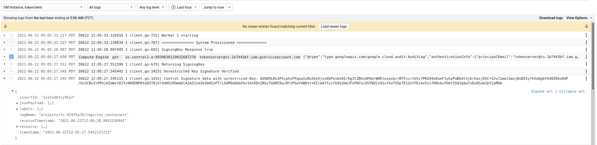

## Remote Authorization and TokenDistributor for GCP VMs

Sample workflow to distribute a secret between two parties where one party directly delivers the secret to a _specific_, deprivileged virtual machine on GCP.  Normally when two parties want to share some data, one party grants IAM permissions on that resource to an identity owned by the other.  That is, if Alice wants to share data with a VM Bob owns,  Alice will grant IAM permissions on some data with the ServiceAccount Bob's VM runs as.  However, Bob essentially has indirect rights on that data simply by assuming the identity of the service account or by simply ssh into that VM and acquiring the service account credentials.  

This is problematic in some situations where Alice would like Bob's VM to process data in isolation but not alow Bob himself from acquiring that data and exfilterating.

The flow described in this repo flow inverts the access where the data owner (Alice) shares some secret material with permissions to sensitive data but **ONLY** to a isolated system owned by Bob.  The data owner (Alice) will share access _exclusively__ to the VM only after attesting some known binary that Alice is aware of and trusts is running on that VM and that that Bob cannot access the VM via SSH or any other means.

>> This is not an officially supported Google product

#### Architecture


In prose:

Alice wants to share a file she has on a GCS with a specific VM Bob started.  Alice and Bob do not work in the same company and do not share GCP projects.

Alice creates a GCP `projectA`
Bob creates a GCP `projectB`

Alice creates creates a VM (`VM-A`) with  `serviceAccountA` and public ip_address `ip-A`
Bob creates creates a VM (`VM-B`) with `serviceAccountB`.

>> Both VMs Alice and Bob run (especially Bob), can be [Confidential Compute Instances](https://cloud.google.com/blog/products/identity-security/introducing-google-cloud-confidential-computing-with-confidential-vms)

Bob and Alice exchange information offline about `ip-A`, `serviceAccountA` and `serviceAccountB` each party uses

Bob grants Alice and `serviceAccountA` permissions to read GCE startup script and metadata for `VM-A` and AuditLog viewer

`VM-A` runs a `TokenService` that functions to validate and return authorized token requests from `VM-B` 

`VM-B` starts and attempts to contact `ip-A` and acquire the secret from the `TokenService`.

`TokenService` is not yet authorized for to give any token for `serviceAccountB` or `VM-B` and does not return a token.

Alice (offline) runs a `Provisioning` application which:
  
Reads `VM-B` startup script data
  
Validates that `VM-B` has been deprivileged (no ssh access)

Validates the docker image running on `VM-B` is known image hash and trusted by Alice) 

Validates the AuditLog for the VM does not indicate the COS image's metadata was ever updated.

Validates the AuditLog for the VM shows the full boot disk creation (eg, from COS base image; not boot disk)

Provisioning Server generates hash of `VM-B` startup script that includes commands to prevent SSH and `docker run` command for the trusted image image.

Provisioning Server saves arbitrary `Secret` data as well as the hash of startupscript, Public IP address, ServiceAccount for the remote VM to Google FireStore using the `instance_id` for `VM-B` as the primary key 

`VM-B` contacts `TokenService`

`VM-B` uses its [instance_identity_document](https://cloud.google.com/compute/docs/instances/verifying-instance-identity#verify_signature) as an auth token to call `VM-A`

`VM-A` verifies the `identity document` is signed by Google

`VM-A` checks `instanceID`, `serviceAccount`, `audience` and other claims in the document.  The identity document must be signed within some duration threshold.

`VM-A` looks up Firestore using the `instanceID` as  the key.

`VM-A` uses GCP Compute API to retrieve the current/active startup script for `VM-B`

`VM-A` compares the hash of the retrieved startup script against the value in Firestore previously authorized, the egress IP address, VM Fingerprint, etc.  If mismatch, return error.

`VM-A` returns encrypted `Secrets` to `VM-B`

If the Secret is a GCP Service Account, use that to download data from Google Services.  


---
- [Start TokenServer Infrastructure and Service (Alice)](#Start-TokenServer-Infrastructure-and-Service-(Alice))
- [Deploy TokenService (Alice)](#Deploy-TokenService-(Alice))
- [Start TokenClient Infrastructure (Bob)](#Start-TokenClient-Infrastructure-(Bob))
- [Deploy TokenClient (Bob)](#Deploy-TokenClient-(Bob))
- [Provision TokenClient vm_id (Alice)](#Provision-TokenClient-vm_id-(Alice))

### Setup

This repo will configure the full TokenService infrastructure and Service:

1. Alice will use Terraform to create new GCP Project
2. Bob will Terraform to create new GCP Project
3. Alice and Bob will exchange specifications of ServiceAccounts and IP address of TokenService
5. Alice will use Terraform to create TokenServer
6. Bob will use Terraform to create TokenClient
7. Alice will use `Provisioning` application to authorize Bob's VM and ServiceAccount.
8. TokenServer will return secret to TokenClient

  *It is expected customers will customize the client and server to suite their needs.*

If you do not want to use terraform, the `gcloud_setup/` folder contains command sequences in gcloud.

Alice and Bob will both need:

* [terraform](terraform.io) version *`0.13 +`*
* `go 1.14`
* Permissions to create GCP Projects
* `gcloud` CLI

Note: Alice and Bob can setup their infrastructure and deploy applications pretty much independently.
However, Bob will need to know the TokenServer IP and projectID before he deploy the TokenClient

### Start TokenServer Infrastructure and Service (Alice)

As Alice, you will need your

*  [Billing Account ID](https://cloud.google.com/billing/docs/how-to/manage-billing-account) 
  `gcloud beta billing accounts list`

* OrganizationID
  `gcloud organizations list`
  If you do not have an organization, edit `alice/main.tf` and remove the `org_id` variable from `google_project`
 
Alice should also login to local gcloud for both cli and application-default credentials sources

```bash
gcloud auth login
gcloud auth application-default login
```

```bash
export TF_VAR_org_id=673208782222
export TF_VAR_billing_account=000C16-9779B5-12345

# requires terraform == 0.13+ for docker provider
terraform init  

terraform apply --target=module.ts_setup -auto-approve

terraform apply --target=module.ts_build -auto-approve
```

You should see the new project details and IP address allocated/assigned for the `TokenServer`

```bash
ts_address = "34.136.142.112"
ts_image_hash = "sha256:341c39facaab9f19c4172b546fb6ed0ff5365d1c3ba0a622a4d5a4d9ea3c2fa6"
ts_project_id = "ts-1b7443bf"
ts_project_number = "925569020848"
ts_service_account = "tokenserver@ts-1b7443bf.iam.gserviceaccount.com"
```


### Deploy TokenService (Alice)

Deploy the TokenService with defaults.  The command below will deploy an _unconfigured_ TokenServer with a static IP address (`TF_VAR_ts_address`)

```bash
terraform apply --target=module.ts_deploy -auto-approve
```

The terraform script `alice/deploy/main.tf` uses the default options described below.  Modify the startup commands appropriately and redeploy the Server as needed.

| Option | Description |
|:------------|-------------|
| **`-grpcport`** | host:port for the grpcServer(s) listener (default `:50051`|
| **`-useMTLS`** | Use mTLS. |
| **`-useALTS`** | Use ALTS. |
| **`-useSecrets`** | Use GCP Secret Manager for mTLS Certificates  (not valid if useALTS is set) |
| **`-tlsCert`** | TLS Certificate file for mTLS; specify either file or Secret Manager Path  (not valid if useALTS is set) |
| **`-tlsKey`** | TLS CertiKeyficate file for mTLS; specify either file or Secret Manager Path (not valid if useALTS is set)) |
| **`-tlsCertChain`** | TLS Certificate Chain file for mTLS; specify either file or Secret Manager Path (not valid if useALTS is set) |
| **`-tsAudience`** | The audience value for the tokenServer (default: `"https://tokenserver"`) |
| **`-validatePeerIP`** | Extract the PeerIP address for the TokenClient from the TLS Session and compare with provisioned value. |
| **`-validatePeerSN`** | Extract the SSL Serial Number and compare to provisioned value |
| **`-useTPM`** | Enable TPM based Remote Attestation flows (default: `false`) |
| **`-expectedPCRValue`** | ExpectedPCRValue from Quote/Verify (default: `PCR 0:  24af52a4f429b71a3184a6d64cddad17e54ea030e2aa6576bf3a5a3d8bd3328f`) |
| **`-pcr`** | PCR Bank to use for quote/verify (default: `0`) |
| **`-firestoreProjectId`** | ProjectID where the FireStore database is hosted. |
| **`-firestoreCollectionName`** | Name of the collection where provisioned values are saved (default: `foo`) |
| **`-jwtIssuedAtJitter`** | Validate the IssuedAt timestamp.  If issuedAt+jwtIssueAtJitter > now(), then reject (default: `1`) |

Note: if you would rather use an existing project for either the Client or Server, see the section in the Appendix.

**Provide Bob the values of `ts_address` and `ts_service_account` variables anytime later**

```bash
export TF_VAR_ts_project_id=`terraform output -raw -state=terraform.tfstate ts_project_id`
export TF_VAR_ts_service_account=`terraform output -raw -state=terraform.tfstate ts_service_account`
export TF_VAR_ts_address=`terraform output -raw -state=terraform.tfstate ts_address`

echo
echo "Provide the following to Bob"
echo
echo export TF_VAR_ts_project_id=$TF_VAR_ts_project_id
echo export TF_VAR_ts_service_account=$TF_VAR_ts_service_account
echo export TF_VAR_ts_address=$TF_VAR_ts_address
```

In this case its

```bash
$ echo $TF_VAR_ts_service_account
  tokenserver@ts-1b7443bf.iam.gserviceaccount.com

$ echo $TF_VAR_ts_address
  34.136.142.112
```

### Start TokenClient Infrastructure (Bob)

As Bob, you will need your

*  [Billing Account ID](https://cloud.google.com/billing/docs/how-to/manage-billing-account) 

* OrganizationID
  `gcloud organizations list`
  If you do not have an organization, edit `alice/main.tf` and remove the `org_id` variable from `google_project`
 
The following will startup Bobs infrastructure (GCP project, and allocate IP for tokenClient). The `tc_build` step will also generate the docker image
for the TokenClient but not deploy it yet

This step can be done independently of Alice at anytime (i.e, concurrently with any of the prior steps taken by Alice)


```bash
export TF_VAR_org_id=111108786098
export TF_VAR_billing_account=22121-9779B5-30076F

terraform init

terraform apply --target=module.tc_setup -auto-approve

terraform apply --target=module.tc_build -auto-approve
```

The command will create a new GCP project, enable GCP api services, create a service account for the Token server and allocate a static IP:

```bash
tc_address = "34.121.225.36"
tc_image_hash = "sha256:eea4812c723e6d39d4261504508c0903c1c0958fc6ec25a9cad906c57ea610a9"
tc_project_id = "tc-4f4f5a70"
tc_project_number = "634665912513"
tc_service_account = "tokenclient@tc-4f4f5a70.iam.gserviceaccount.com"
```

### Deploy TokenClient (Bob)

Bob will now deploy the TokenClient

Bob needs to set some additional environment variables that were *provided by Alice* earlier:

* `TF_VAR_ts_service_account`:  this is the service account Alice is using for the TokenServer (`tokenserver@ts-039e6b6a.iam.gserviceaccount.com`)
* `TF_VAR_ts_address`: this is the IP address of the TokenServer (`34.72.145.220`)
* `TF_VAR_ts_provisioner`: this is Alice's email address that Bob will authorize to read the TokenClients metadata values (eg `export TF_VAR_ts_provisioner=alice@esodemoapp2.com`)

Make sure the env vars are set (`TF_VAR_project_id` would be the the TokenClient (Bob) project)

>> this step is really important <<<

`TF_VAR_ts_provisioner` is the email/serviceAccount that will run the provisioning application.  This is needed so that Bob can allow the provisioning application to read the GCE metadata. For example, if Alice herself is running the privisoning app, it'd be `export TF_VAR_ts_provisioner=alice@domain.com`.  The configuration below is assuming the user running terraform is the approver itself.

```bash
export TF_VAR_ts_service_account=<value given by Alice>
export TF_VAR_ts_address=<value given by Alice>
export TF_VAR_ts_provisioner=`gcloud config get-value core/account`

echo $TF_VAR_ts_service_account
echo $TF_VAR_ts_address
echo $TF_VAR_ts_provisioner
```

or specify them inline here:

Then deploy it to a VM

```bash
terraform apply --target=module.tc_deploy \
 -var="ts_service_account=$TF_VAR_ts_service_account" \
 -var="ts_address=$TF_VAR_ts_address" \
 -var="ts_provisioner=$TF_VAR_ts_provisioner" \
 -auto-approve
```

The terraform script `bob/deploy/main.tf` uses the default options described below.  Modify the startup commands appropriately and redeploy the Client VM as needed.

| Option | Description |
|:------------|-------------|
| **`-address`** | host:port for the TokenServer |
| **`-useMTLS`** | Use mTLS instead of TLS. |
| **`-useALTS`** | Use ALTS. |
| **`-tsAudience`** | Audience value to assign when generating and `id_token`.  Must match what the TokenServer expects (default: `"https://tokenservice"`) |
| **`-useSecrets`** | Use GCP Secret Manager for mTLS Certificates (not valid if useALTS is set) |
| **`-tlsClientCert`** | TLS Certificate file for mTLS; specify either file or Secret Manager Path (not valid if useALTS is set) |
| **`-tlsClientKey`** | TLS CertiKeyficate file for mTLS; specify either file or Secret Manager Path  (not valid if useALTS is set) |
| **`-tlsCertChain`** | TLS Certificate Chain file for mTLS; specify either file or Secret Manager Path (not valid if useALTS is set) |
| **`-sniServerName`** | SNI ServerName for the TLS connection (default: `tokenservice.esodemoapp2.com`; valid only for mTLS) |
| **`-serviceAccount`** | Path to GCP ServiceAccount JSON file to use to authenticate to authenticate to FireStore and GCE API (default: not used) |
| **`-firestoreProjectId`** | ProjectID where the FireStore database is hosted. |
| **`-useTPM`** | Enable TPM operations |
| **`-doAttestation`** | Start offer to Make/Activate Credential flow |
| **`-exchangeSigningKey`** | Offer RSA Signing Key (requires --doAttestation) |
| **`-tokenServerServiceAccount`** | Service Account for the TokenServer  (valid only if useALTS is set) |
| **`-maxLoop`** | Number of attempts the TokenClient will make to acquire a token (default: `360`) |
| **`-pollWaitSeconds`** | Number of seconds to wait between attempts (default: `10s`)|

You should see an output like:

```bash
tc_address = "34.121.225.36"
tc_image_hash = "sha256:eea4812c723e6d39d4261504508c0903c1c0958fc6ec25a9cad906c57ea610a9"
tc_instance_id = "8939838129032687278"
tc_project_id = "tc-4f4f5a70"
tc_project_number = "634665912513"
tc_service_account = "tokenclient@tc-4f4f5a70.iam.gserviceaccount.com"
```

Note the `tc_instance_id` and `tc_project_id`. 

```bash
export TF_VAR_tc_project_id=`terraform output -raw -state=terraform.tfstate tc_project_id`
export TF_VAR_tc_instance_id=`terraform output -raw -state=terraform.tfstate tc_instance_id`
export TF_VAR_tc_address=`terraform output -raw -state=terraform.tfstate tc_address`

echo
echo "Provide the following to Alice:"
echo
echo export TF_VAR_tc_project_id=$TF_VAR_tc_project_id
echo export TF_VAR_tc_instance_id=$TF_VAR_tc_instance_id
echo export TF_VAR_tc_address=$TF_VAR_tc_address
```

** Provide these values to Alice for provisioning**

### Interlude

At this point the TokenClient and Server have started communicating but every request for a new token would fail since Alice hasn't yet vetted the integrity of the `TokenClient`:

You can see this in the logs

The tokenClient will attempt to contact tokenServer.  Since no vmID is provisioned, the tokenserver will respond w/ error

- TokenServer


- TokenClient


So...now 

>> **Provide token_client_instance_id to TokenServer Provisioning admin (Alice) so it can be provisioned**

Optionally provide `tc_address` to Alice (incase she wants to also a firewall around TokenServer or origin checks if NAT isn't used)


### Provision TokenClient vm_id (Alice)

Use `vm_id` to provision the Firestore Database after validating Bob's VM state

As Alice, 
```bash
export TF_VAR_tc_project_id=`<value given by Bob>`
export TF_VAR_tc_instance_id=`<value given by Bob>`
export TF_VAR_tc_address=`<value given by Bob>`
export TF_VAR_ts_project_id=`terraform output -raw -state=terraform.tfstate ts_project_id`


echo $TF_VAR_tc_project_id
echo $TF_VAR_tc_instance_id
echo $TF_VAR_tc_address
echo $TF_VAR_ts_project_id

$ cd app/
```

Now provision the secrets you want to transfer as a formatted JSON file that maps to the `.proto` Secret struct:

- Secrets `proto`:

```proto
message Secret {
  string name = 1;
  SecretType type = 2;
  bytes data = 3;

  enum SecretType {
    RAW = 0;   // do not decode;
    TPM = 1;   // decode as TPM sealed data
    TINK = 2;  // decode as Tink Secret
  }  
}
message TokenResponse {
  string responseID = 1;
  string inResponseTo = 2;
  repeated Secret secrets = 3;  // this is a repeated field
}
```

The following `secrets.json` describes two secrets of differing types

```json
[
    {
        "name": "secret1",
        "type": "RAW",
        "data": "Zm9vb2Jhcg=="
    },
    {
        "name": "secret2",
        "type": "TINK",
        "data": "CLnwmtYGEmQKWAowdHlwZS5nb29nbGVhcGlzLmNvbS9nb29nbGUuY3J5cHRvLnRpbmsuQWVzR2NtS2V5EiIaIA7TocwCm37/3vReEGSRsoSp+a0KAq+KYEKqKH5dVqC4GAEQARi58JrWBiAB"
    }
]
```

The datafield is a base64encoded string of the actual secret.

Then provision

```bash
go run src/provisioner/provisioner.go --fireStoreProjectId $TF_VAR_ts_project_id --firestoreCollectionName foo \
    --clientProjectId $TF_VAR_tc_project_id --clientVMZone us-central1-a --peerAddress=$TF_VAR_tc_address --peerSerialNumber=5 \
    --clientVMId $TF_VAR_tc_instance_id  --secretsFile=secrets.json
```


| Option | Description |
|:------------|-------------|
| **`-fireStoreProjectId`** | ProjectID for Firestore |
| **`-firestoreCollectionName`** | Firestore CollectionID (default: `foo`) |
| **`-clientProjectId`** | ProjectID for the TokenClient to lookup GCE VM specifications  |
| **`-clientVMZone`** | Zone where the TokenClient Runs |
| **`-clientVMId`** | Unique vm_id for the TokenClient |
| **`-secretsFile`** | Path to Secrets JSON file |
| **`-peerAddress`** | Expected IP address of the TokenClient |
| **`-peerSerialNumber`** | Expected mTLS Serial number sent by TokenClient |
| **`-useTPM`** | Enable TPM operations |
| **`-attestationPCR`** | PCR Bank to use for Attestation (default: `0`) |
| **`-attestationPCRValue`** | PCR Bank value Attestation (default: `24af52a4f429b71a3184a6d64cddad17e54ea030e2aa6576bf3a5a3d8bd3328f`) |

The output of the provisioning step will prompt Alice to confirm that the image startup script and metadata looks valid.

At that point, the image hash value will be saved into Firestore `v7SftwlRj75WRXCq0Q/buov8D7t+Sg08fRqaylohfiI=`  using the `vm_id=8939838129032687278` in firestore document key.  Every time the TokenClient makes a request for a security token, the TokenServer will lookup the document and verify the image hash is still the one that was authorized.

The output also shows the unique `Fingerprint` of the VM `2020/07/22 09:47:32 Image Fingerprint: [yM8bKId-VQA=]`. 

```bash
$ go run src/provisioner/provisioner.go --fireStoreProjectId $TF_VAR_ts_project_id --firestoreCollectionName foo \
    --clientProjectId $TF_VAR_tc_project_id --clientVMZone us-central1-a --clientVMId $TF_VAR_tc_instance_id  \
    --secretsFile=secrets.json \
    --useTPM --attestationPCR=0 --attestationPCRValue=24af52a4f429b71a3184a6d64cddad17e54ea030e2aa6576bf3a5a3d8bd3328f

$ go run src/provisioner/provisioner.go --fireStoreProjectId $TF_VAR_ts_project_id --firestoreCollectionName foo \
    --clientProjectId $TF_VAR_tc_project_id --clientVMZone us-central1-a --peerAddress=$TF_VAR_tc_address --peerSerialNumber=5 \
    --clientVMId $TF_VAR_tc_instance_id  --secretsFile=secrets.json
2021/06/22 08:05:00 tc-4f4f5a70  us-central1-a  8939838129032687278
2021/06/22 08:05:00 Found  VM instanceID "8939838129032687278"
2021/06/22 08:05:00 Image Data: #cloud-config

write_files:
- path: /etc/systemd/system/cloudservice.service
  permissions: 0644
  owner: root
  content: |
    [Unit]
    Description=Start a simple docker container
    Wants=gcr-online.target
    After=gcr-online.target

    [Service]
    Environment="HOME=/home/cloudservice"
    ExecStartPre=/usr/bin/docker-credential-gcr configure-docker
    ExecStart=/usr/bin/docker run --rm -u 0 --device=/dev/tpm0:/dev/tpm0 --name=mycloudservice gcr.io/tc-4f4f5a70/tokenclient@sha256:eea4812c723e6d39d4261504508c0903c1c0958fc6ec25a9cad906c57ea610a9 --address 34.136.142.112:50051 --servername tokenservice.esodemoapp2.com --tsAudience https://tokenserver --useMTLS --useSecrets  --tlsClientCert projects/634665912513/secrets/tls_crt --tlsClientKey projects/634665912513/secrets/tls_key --tlsCertChain projects/634665912513/secrets/tls-ca --useTPM --doAttestation --exchangeSigningKey --v=25 -alsologtostderr
    ExecStop=/usr/bin/docker stop mycloudservice
    ExecStopPost=/usr/bin/docker rm mycloudservice

bootcmd:
- iptables -D INPUT -p tcp -m tcp --dport 22 -j ACCEPT
- systemctl mask --now serial-getty@ttyS0.service

runcmd:
- systemctl daemon-reload
- systemctl start cloudservice.service

2021/06/22 08:05:00      Found  VM initScriptHash: [v7SftwlRj75WRXCq0Q/buov8D7t+Sg08fRqaylohfiI=]
2021/06/22 08:05:00      Found  VM CreationTimestamp "2021-06-22T04:57:59.255-07:00"
2021/06/22 08:05:00      Found  VM Fingerprint "sSHMqlnfdVM="
2021/06/22 08:05:00      Found  VM CpuPlatform "AMD Rome"
2021/06/22 08:05:00      Found  VM Boot Disk Source "https://www.googleapis.com/compute/v1/projects/tc-4f4f5a70/zones/us-central1-a/disks/tokenclient"
2021/06/22 08:05:01      Found Disk Image https://www.googleapis.com/compute/v1/projects/cos-cloud/global/images/cos-stable-81-12871-119-0
2021/06/22 08:05:01      Found  VM ServiceAccount "tokenclient@tc-4f4f5a70.iam.gserviceaccount.com"
2021/06/22 08:05:01 Found VM External IP 34.121.225.36
2021/06/22 08:05:01 ===========  Instance AuditLog Start =========== 
2021/06/22 08:05:03 LogEntry:
2021/06/22 08:05:03     Severity Notice
2021/06/22 08:05:03     TimeStamp @2021-06-22T11:58:09Z
2021/06/22 08:05:03     Service Name  [compute.googleapis.com]
2021/06/22 08:05:03     Method Name [beta.compute.instances.insert]
2021/06/22 08:05:03     AuthenticationInfo [principal_email:"admin@esodemoapp2.com"]
2021/06/22 08:05:03     Request fields:{key:"@type"  value:{string_value:"type.googleapis.com/compute.instances.insert"}}
2021/06/22 08:05:03     ============

2021/06/22 08:05:03 LogEntry:
2021/06/22 08:05:03     Severity Notice
2021/06/22 08:05:03     TimeStamp @2021-06-22T11:57:52Z
2021/06/22 08:05:03     Service Name  [compute.googleapis.com]
2021/06/22 08:05:03     Method Name [beta.compute.instances.insert]
2021/06/22 08:05:03     AuthenticationInfo [principal_email:"admin@esodemoapp2.com"]
2021/06/22 08:05:03     Request fields:{key:"@type"  value:{string_value:"type.googleapis.com/compute.instances.insert"}}  fields:{key:"canIpForward"  value:{bool_value:false}}  fields:{key:"deletionProtection"  value:{bool_value:false}}  fields:{key:"description"  value:{string_value:"TokenClient"}}  fields:{key:"disks"  value:{list_value:{values:{struct_value:{fields:{key:"autoDelete"  value:{bool_value:true}}  fields:{key:"boot"  value:{bool_value:true}}  fields:{key:"initializeParams"  value:{struct_value:{fields:{key:"sourceImage"  value:{string_value:"projects/cos-cloud/global/images/cos-stable-81-12871-119-0"}}}}}  fields:{key:"mode"  value:{string_value:"READ_WRITE"}}}}}}}  fields:{key:"machineType"  value:{string_value:"projects/tc-4f4f5a70/zones/us-central1-a/machineTypes/e2-small"}}  fields:{key:"name"  value:{string_value:"tokenclient"}}  fields:{key:"networkInterfaces"  value:{list_value:{values:{struct_value:{fields:{key:"accessConfigs"  value:{list_value:{values:{struct_value:{fields:{key:"natIP"  value:{string_value:"34.121.225.36"}}  fields:{key:"type"  value:{string_value:"ONE_TO_ONE_NAT"}}}}}}}  fields:{key:"network"  value:{string_value:"projects/tc-4f4f5a70/global/networks/tcnetwork"}}}}}}}  fields:{key:"scheduling"  value:{struct_value:{fields:{key:"automaticRestart"  value:{bool_value:true}}  fields:{key:"onHostMaintenance"  value:{string_value:"MIGRATE"}}  fields:{key:"preemptible"  value:{bool_value:false}}}}}  fields:{key:"serviceAccounts"  value:{list_value:{values:{struct_value:{fields:{key:"email"  value:{string_value:"tokenclient@tc-4f4f5a70.iam.gserviceaccount.com"}}  fields:{key:"scopes"  value:{list_value:{values:{string_value:"https://www.googleapis.com/auth/cloud-platform"}  values:{string_value:"https://www.googleapis.com/auth/userinfo.email"}}}}}}}}}  fields:{key:"shieldedInstanceConfig"  value:{struct_value:{fields:{key:"enableIntegrityMonitoring"  value:{bool_value:true}}  fields:{key:"enableSecureBoot"  value:{bool_value:true}}  fields:{key:"enableVtpm"  value:{bool_value:true}}}}}  fields:{key:"tags"  value:{struct_value:{fields:{key:"tags"  value:{list_value:{values:{string_value:"tokenclient"}}}}}}}
2021/06/22 08:05:03     ============

2021/06/22 08:05:03 ===========  Instance AuditLog End =========== 
2021/06/22 08:05:03 looks ok? (y/N): 
y
2021/06/22 08:05:15 2021-06-22 12:05:15.128201 +0000 UTC
2021/06/22 08:05:15 Document data: "8939838129032687278"

```

Note that Alice not trusts the entire TokenClient vm Image hash which itself includes a docker image hash 
(`docker pull gcr.io/tc-4f4f5a70/tokenclient@sha256:eea4812c723e6d39d4261504508c0903c1c0958fc6ec25a9cad906c57ea610a9`).  
It is expected that this image was generated elsewhere such that both Alice and Bob would know the precise and source code that it includes.  
Docker based images will not generate deterministic builds but you can use `Bazel` as described in [Building deterministic Docker images with Bazel](https://blog.bazel.build/2015/07/28/docker_build.html) and as an example:


- [go with bazel with grpc with container](https://github.com/salrashid123/go-grpc-bazel-docker))

You can find more information about how to build the TokenClient and TokenServer in the appendix.

#### VM Startup and base image verification

Suppose Bob deploys non COS or Confidential compute image or a boot disk not sourced from 
`https://www.googleapis.com/compute/v1/projects/cos-cloud/global/images/cos-stable-81-12871-119-0`, and instead used a `fakeimage`

```yaml
resource "google_compute_instance" "tokenclient" {
  name         = "tokenclient"
  machine_type = "e2-small"
  # machine_type = "n2d-standard-2"    # for SEV
  description = "TokenClient"
  project = var.project_id  
  zone = var.zone
  boot_disk {
    initialize_params {
      # image = "cos-cloud/cos-stable-81-12871-119-0"
      image = "projects/tc-4f4f5a70/global/images/fakeimage"
      # image = "confidential-vm-images/cos-stable-89-16108-403-47"   # for SEV
    }
  }
```

then during provisioning, the disk image and startup sequence is clearly shown (at that point, you should click "No")

```log
$ go run src/provisioner/provisioner.go --fireStoreProjectId $TF_VAR_ts_project_id --firestoreCollectionName foo \
    --clientProjectId $TF_VAR_tc_project_id --clientVMZone us-central1-a --peerAddress=$TF_VAR_tc_address --peerSerialNumber=5 \
    --clientVMId $TF_VAR_tc_instance_id  --secretsFile=secrets.json
2021/06/22 08:44:59 tc-4f4f5a70  us-central1-a  5701091505452377594
2021/06/22 08:44:59 Found  VM instanceID "5701091505452377594"
2021/06/22 08:44:59 Image Data: #cloud-config

write_files:
- path: /etc/systemd/system/cloudservice.service
  permissions: 0644
  owner: root
  content: |
    [Unit]
    Description=Start a simple docker container
    Wants=gcr-online.target
    After=gcr-online.target

    [Service]
    Environment="HOME=/home/cloudservice"
    ExecStartPre=/usr/bin/docker-credential-gcr configure-docker
    ExecStart=/usr/bin/docker run --rm -u 0 --device=/dev/tpm0:/dev/tpm0 --name=mycloudservice gcr.io/tc-4f4f5a70/tokenclient@sha256:eea4812c723e6d39d4261504508c0903c1c0958fc6ec25a9cad906c57ea610a9 --address 34.136.142.112:50051 --servername tokenservice.esodemoapp2.com --tsAudience https://tokenserver --useMTLS --useSecrets  --tlsClientCert projects/634665912513/secrets/tls_crt --tlsClientKey projects/634665912513/secrets/tls_key --tlsCertChain projects/634665912513/secrets/tls-ca --useTPM --doAttestation --exchangeSigningKey --v=25 -alsologtostderr
    ExecStop=/usr/bin/docker stop mycloudservice
    ExecStopPost=/usr/bin/docker rm mycloudservice

bootcmd:
- iptables -D INPUT -p tcp -m tcp --dport 22 -j ACCEPT
- systemctl mask --now serial-getty@ttyS0.service

runcmd:
- systemctl daemon-reload
- systemctl start cloudservice.service

2021/06/22 08:44:59      Found  VM initScriptHash: [v7SftwlRj75WRXCq0Q/buov8D7t+Sg08fRqaylohfiI=]
2021/06/22 08:44:59      Found  VM CreationTimestamp "2021-06-22T05:44:06.372-07:00"
2021/06/22 08:44:59      Found  VM Fingerprint "HHqf-5_bcaY="
2021/06/22 08:44:59      Found  VM CpuPlatform "AMD Rome"

>>>>>>>>>>>>>>>>>>>>>>>>>>>>>>>>>>>>>>>>>>>>>>>>>>>>>>>>>>>>>>>>>>>>>>>
2021/06/22 08:44:59      Found  VM Boot Disk Source "https://www.googleapis.com/compute/v1/projects/tc-4f4f5a70/zones/us-central1-a/disks/tokenclient"
2021/06/22 08:45:00      Found Disk Image https://www.googleapis.com/compute/v1/projects/tc-4f4f5a70/global/images/fakeimage
>>>>>>>>>>>>>>>>>>>>>>>>>>>>>>>>>>>>>>>>>>>>>>>>>>>>>>>>>>>>>>>>>>>>>>>


2021/06/22 08:45:00      Found  VM ServiceAccount "tokenclient@tc-4f4f5a70.iam.gserviceaccount.com"
2021/06/22 08:45:00 Found VM External IP 34.121.225.36
2021/06/22 08:45:00 ===========  Instance AuditLog Start =========== 
2021/06/22 08:45:02 LogEntry:
2021/06/22 08:45:02     Severity Notice
2021/06/22 08:45:02     TimeStamp @2021-06-22T12:44:16Z
2021/06/22 08:45:02     Service Name  [compute.googleapis.com]
2021/06/22 08:45:02     Method Name [beta.compute.instances.insert]
2021/06/22 08:45:02     AuthenticationInfo [principal_email:"admin@esodemoapp2.com"]
2021/06/22 08:45:02     Request fields:{key:"@type"  value:{string_value:"type.googleapis.com/compute.instances.insert"}}
2021/06/22 08:45:02     ============

2021/06/22 08:45:02 LogEntry:
2021/06/22 08:45:02     Severity Notice
2021/06/22 08:45:02     TimeStamp @2021-06-22T12:44:05Z
2021/06/22 08:45:02     Service Name  [compute.googleapis.com]
2021/06/22 08:45:02     Method Name [beta.compute.instances.insert]
2021/06/22 08:45:02     AuthenticationInfo [principal_email:"admin@esodemoapp2.com"]
2021/06/22 08:45:02     Request fields:{key:"@type"  value:{string_value:"type.googleapis.com/compute.instances.insert"}}  fields:{key:"canIpForward"  value:{bool_value:false}}  fields:{key:"deletionProtection"  value:{bool_value:false}}  fields:{key:"description"  value:{string_value:"TokenClient"}}  fields:{key:"disks"  value:{list_value:{values:{struct_value:{fields:{key:"autoDelete"  value:{bool_value:true}}  fields:{key:"boot"  value:{bool_value:true}}  fields:{key:"initializeParams"  value:{struct_value:{fields:{key:"sourceImage"  value:{string_value:"projects/tc-4f4f5a70/global/images/fakeimage"}}}}}  fields:{key:"mode"  value:{string_value:"READ_WRITE"}}}}}}}  fields:{key:"machineType"  value:{string_value:"projects/tc-4f4f5a70/zones/us-central1-a/machineTypes/e2-small"}}  fields:{key:"name"  value:{string_value:"tokenclient"}}  fields:{key:"networkInterfaces"  value:{list_value:{values:{struct_value:{fields:{key:"accessConfigs"  value:{list_value:{values:{struct_value:{fields:{key:"natIP"  value:{string_value:"34.121.225.36"}}  fields:{key:"type"  value:{string_value:"ONE_TO_ONE_NAT"}}}}}}}  fields:{key:"network"  value:{string_value:"projects/tc-4f4f5a70/global/networks/tcnetwork"}}}}}}}  fields:{key:"scheduling"  value:{struct_value:{fields:{key:"automaticRestart"  value:{bool_value:true}}  fields:{key:"onHostMaintenance"  value:{string_value:"MIGRATE"}}  fields:{key:"preemptible"  value:{bool_value:false}}}}}  fields:{key:"serviceAccounts"  value:{list_value:{values:{struct_value:{fields:{key:"email"  value:{string_value:"tokenclient@tc-4f4f5a70.iam.gserviceaccount.com"}}  fields:{key:"scopes"  value:{list_value:{values:{string_value:"https://www.googleapis.com/auth/cloud-platform"}  values:{string_value:"https://www.googleapis.com/auth/userinfo.email"}}}}}}}}}  fields:{key:"shieldedInstanceConfig"  value:{struct_value:{fields:{key:"enableIntegrityMonitoring"  value:{bool_value:true}}  fields:{key:"enableSecureBoot"  value:{bool_value:true}}  fields:{key:"enableVtpm"  value:{bool_value:true}}}}}  fields:{key:"tags"  value:{struct_value:{fields:{key:"tags"  value:{list_value:{values:{string_value:"tokenclient"}}}}}}}
2021/06/22 08:45:02     ============

2021/06/22 08:45:02 ===========  Instance AuditLog End =========== 
2021/06/22 08:45:02 looks ok? (y/N):
```

#### VM Metadata editing 

The cos-init script is saved into instance metadata and should not be editable.  If Bob edits the cos metadata before provisioning, the audit log would show that during provisioning:

```log
$ go run src/provisioner/provisioner.go --fireStoreProjectId $TF_VAR_ts_project_id --firestoreCollectionName foo     --clientProjectId $TF_VAR_tc_project_id --clientVMZone us-central1-a --peerAddress=$TF_VAR_tc_address --peerSerialNumber=5     --clientVMId $TF_VAR_tc_instance_id  --secretsFile=secrets.json

2021/06/22 08:51:58 tc-4f4f5a70  us-central1-a  6332740435730784933
2021/06/22 08:51:58 Found  VM instanceID "6332740435730784933"
2021/06/22 08:51:58 Image Data: #cloud-config

write_files:
- path: /etc/systemd/system/cloudservice.service
  permissions: 0644
  owner: root
  content: |
    [Unit]
    Description=Start a simple docker container
    Wants=gcr-online.target
    After=gcr-online.target

    [Service]
    Environment="HOME=/home/cloudservice"
    ExecStartPre=/usr/bin/docker-credential-gcr configure-docker
    ExecStart=/usr/bin/docker run --rm -u 0 --device=/dev/tpm0:/dev/tpm0 --name=mycloudservice gcr.io/tc-4f4f5a70/tokenclient@sha256:eea4812c723e6d39d4261504508c0903c1c0958fc6ec25a9cad906c57ea610a9 --address 34.136.142.112:50052 --servername tokenservice.esodemoapp2.com --tsAudience https://tokenserver --useMTLS --useSecrets  --tlsClientCert projects/634665912513/secrets/tls_crt --tlsClientKey projects/634665912513/secrets/tls_key --tlsCertChain projects/634665912513/secrets/tls-ca --useTPM --doAttestation --exchangeSigningKey --v=25 -alsologtostderr
    ExecStop=/usr/bin/docker stop mycloudservice
    ExecStopPost=/usr/bin/docker rm mycloudservice

bootcmd:
- iptables -D INPUT -p tcp -m tcp --dport 22 -j ACCEPT
- systemctl mask --now serial-getty@ttyS0.service

runcmd:
- systemctl daemon-reload
- systemctl start cloudservice.service
2021/06/22 08:51:58      Found  VM initScriptHash: [700Dma/2uMOpNNcHAF7vjZUrrk7ZBCSdTiaUrPM0GJA=]
2021/06/22 08:51:58      Found  VM CreationTimestamp "2021-06-22T05:49:15.472-07:00"
2021/06/22 08:51:58      Found  VM Fingerprint "gfpbP5Jrxhc="
2021/06/22 08:51:58      Found  VM CpuPlatform "Intel Haswell"
2021/06/22 08:51:58      Found  VM Boot Disk Source "https://www.googleapis.com/compute/v1/projects/tc-4f4f5a70/zones/us-central1-a/disks/tokenclient"
2021/06/22 08:51:58      Found Disk Image https://www.googleapis.com/compute/v1/projects/cos-cloud/global/images/cos-stable-81-12871-119-0
2021/06/22 08:51:58      Found  VM ServiceAccount "tokenclient@tc-4f4f5a70.iam.gserviceaccount.com"
2021/06/22 08:51:58 Found VM External IP 34.121.225.36
2021/06/22 08:51:59 ===========  Instance AuditLog Start =========== 
2021/06/22 08:52:00 LogEntry:
2021/06/22 08:52:00     Severity Notice
2021/06/22 08:52:00     TimeStamp @2021-06-22T12:51:46Z
2021/06/22 08:52:00     Service Name  [compute.googleapis.com]
2021/06/22 08:52:00     Method Name [v1.compute.instances.setMetadata]
2021/06/22 08:52:00     AuthenticationInfo [principal_email:"admin@esodemoapp2.com"]
2021/06/22 08:52:00     Request fields:{key:"@type"  value:{string_value:"type.googleapis.com/compute.instances.setMetadata"}}  fields:{key:"Metadata Keys Modified"  value:{list_value:{values:{string_value:"user-data"}}}}
2021/06/22 08:52:00     ============

2021/06/22 08:52:00 >>>> SetMetadata called on instance, there is no reason this should happen!
```

#### VM Fingerprint verification

The `fingerprint` value is a hash of the entire VM's state and configuration.  Any change (stop/restart, metadata update, etc) will change its value.  You can use this VM fingerprint to ensure that when the tokenclient makes a request, the VM is in the same state it was originally provisioned against 

Do not run the following commands during setup of this demo.

```bash
$ gcloud compute instances describe $TF_VAR_tc_instance_id --zone us-central1-a --project tc-e381ee09 --format="value(fingerprint)"
sSHMqlnfdVM=

$ gcloud compute instances stop $TF_VAR_tc_instance_id --zone us-central1-a --project tc-e381ee09 
$ gcloud compute instances start $TF_VAR_tc_instance_id --zone us-central1-a --project tc-e381ee09 

$ gcloud compute instances describe $TF_VAR_tc_instance_id --zone us-central1-a --project tc-e381ee09 --format="value(fingerprint)"
Y0hv2RZ_Qy0=

# change any metadata using console
$ gcloud compute instances describe $TF_VAR_tc_instance_id --zone us-central1-a --project tc-e381ee09  --format="value(fingerprint)"
SRVm69LywSw=
```

The following code snippet in the tokenserver performs a _runtime_ crosscheck against the value stored in firestore.

```golang
if cresp.Fingerprint != c.ImageFingerprint {
	glog.Errorf("   -------->  Error Image Fingerprint mismatch got [%s]  expected [%s]", cresp.Fingerprint, c.ImageFingerprint)
	return &tokenservice.TokenResponse{}, grpc.Errorf(codes.NotFound, fmt.Sprintf("Error:  ImageFingerpint does not match got [%s]  expected [%s]", cresp.Fingerprint, c.ImageFingerprint))
}
```

#### After Provisioning

After provisioning, the full sequence to exchange encrypted keys takes place.  

- TokenServer

The TokenServer output shows that it successfully authorized the specific TokenClient and returned given the credentials and which matched with a _live_ lookup of the VMid's metadata.   S


- TokenClient

The TokenClient would have acquired the secret key and then performed the optional quote/verify step.  The final step for the Client would be to save the key material to memory and start an arbitrary worker thread that would use the secrets.


```log
I0620 12:27:22.399474       1 client.go:367]      Received  Data: name:"secret1" data:"fooobar"
I0620 12:27:22.399505       1 client.go:370]      Decoding as RAW fooobar
I0620 12:27:22.399513       1 client.go:367]      Received  Data: name:"secret2" type:TINK data:"\x08\xb9\xf0\x9a\xd6\x06\x12d\nX\n0type.googleapis.com/google.crypto.tink.AesGcmKey\x12\"\x1a \x0eӡ\xcc\x02\x9b~\xff\xde\xf4^\x10d\x91\xb2\x84\xa9\xf9\xad\n\x02\xaf\x8a`B\xaa(~]V\xa0\xb8\x18\x01\x10\x01\x18\xb9\xf0\x9a\xd6\x06 \x01"
I0620 12:27:22.399546       1 client.go:380]      Decoding as Tink
I0620 12:27:22.400385       1 client.go:404]      Tink AEAD encrypted text AWrGuDnqX+ANzRzPVXfjN+UZcVgY/6EPREbNyQeazM5togJD
I0620 12:27:22.400414       1 client.go:411]      Tink AEAD Decrypted Text foo
```
#### Firestore

Each clientVM unique vm_id is saved in TokenServer's Firestore database.  Note, the secret is *NOT* encrypted.  Ensure you secure access to FireStore


#### mTLS or ALTS

Both alice and bob must decide upfront if they wish to use mTLS or ALTS (Application Layer Transport Security) for encryption and in the case of ALTS, supplemental authentication.  ALTS only works on GCP at the moment so mTLS is applicable if Alice runs the TokenServer onprem.   The default value is mTLS in this example.

the `main.tf` files for both Alice and Bob have the cloud-init configuration for ALTS commented out.  To use alts, redeploy the service on both ends using the commented versions.

- For reference, see [grpc_alts](https://github.com/salrashid123/grpc_alts)

If mTLS is uses, the issue of key distribution and security of the TLS keys becomes an issue.  The TLS aspect here is used for confidentiality mostly since API requests are always authenticated (using bob's oidc token) and the raw RSA/AES keys that do get transmitted are encrypted such that it can only get decrypted by the TokenClient's vTPM.

To enable any of the mTLS variation or to use ALTS, see the config samples in the appendix


### Building Locally

To Test if your app builds, you need several things:

A) To build the binary locally,

```bash
$ go version
   go version go1.15.2 linux/amd64

$ protoc --version
   libprotoc 3.13.0

$ go get -u github.com/golang/protobuf/protoc-gen-go   
   go: found github.com/golang/protobuf/protoc-gen-go in github.com/golang/protobuf v1.5.2
   go: google.golang.org/protobuf upgrade => v1.26.0

$ /usr/local/bin/protoc -I ./ --include_imports \
   --experimental_allow_proto3_optional --include_source_info \
   --descriptor_set_out=src/tokenservice/tokenservice.proto.pb \
   --go_opt=paths=source_relative \
   --go_out=plugins=grpc:. src/tokenservice/tokenservice.proto


$ go build src/server/server.go
$ go build src/client/client.go
$ go build src/provisioner/provisioner.go
```

#### Deterministic Builds using Bazel

You can build the TokenClient and Server images using Bazel 

Note, as of `6/23/20`, i coudn't get bazel to generate the `.proto.pb`, `.pb.go` files within bazel (eg, option `B` below..which means you have to generate run protoc manually first.).   Run the `Building Locally` step first

```bash
cd app/

bazel build --platforms=@io_bazel_rules_go//go/toolchain:linux_amd64 src/client:tokenclient
bazel run --platforms=@io_bazel_rules_go//go/toolchain:linux_amd64 src/client:tokenclient

bazel build --platforms=@io_bazel_rules_go//go/toolchain:linux_amd64 src/server:tokenserver
bazel run --platforms=@io_bazel_rules_go//go/toolchain:linux_amd64 src/server:tokenserver
```

The images will be

```bash
$ docker images
REPOSITORY                                  TAG                    IMAGE ID            CREATED             SIZE

gcr.io/yourproject/tokenclient/src/client   tokenclient            833121004941        50 years ago        20.7MB
gcr.io/yourproject/tokenserver/src/server   tokenserver            c98ed1bc6e27        50 years ago        30.5MB
```

These images will have a consistent image hash no matter where they are built.

Also note that the generated `tokenservice.pb.go` files were pregenerated.  This is to avoid conflicts due to GCP secretsmanager library which automatically
uses pregenerated library set.  See [Use pre-generated .pb.go files](https://github.com/bazelbuild/rules_go/blob/master/proto/core.rst#option-2-use-pre-generated-pbgo-files).


To build using bazel,  Comment out the relevant require and replace steps in `app/go.mod`:

```golang
require (
	// github.com/salrashid123/gcp_tokendistributor/certparser v0.0.0
	// github.com/salrashid123/gcp_tokendistributor/oid v0.0.0
	// github.com/salrashid123/gcp_tokendistributor/tokenservice v0.0.0
)

replace (
	// github.com/salrashid123/gcp_tokendistributor/certparser => ./src/util/certparser
	// github.com/salrashid123/gcp_tokendistributor/oid => ./src/util/certparser/oid
	// github.com/salrashid123/gcp_tokendistributor/tokenservice => ./src/tokenservice
)
```

then import, compile, build with bazel

```bash
bazel run :gazelle -- update-repos -from_file=go.mod -prune=true -to_macro=repositories.bzl%go_repositories
```

Edit `repositories.bzl`,

replace

```yaml
    go_repository(
        name = "org_golang_x_tools",
        importpath = "golang.org/x/tools",
        sum = "h1:L69ShwSZEyCsLKoAxDKeMvLDZkumEe8gXUZAjab0tX8=",
        version = "v0.1.3",
    )
```

with

```yaml
    go_repository(
        name = "org_golang_x_tools",
        importpath = "golang.org/x/tools",
        sum = "h1:kRBLX7v7Af8W7Gdbbc908OJcdgtK8bOz9Uaj8/F1ACA=",
        version = "v0.1.2",
    ) 
```

A) if you want to reuse compiled the protos from the `Building binary Locally` step, 

then in `src/tokenservice/BUILD.bazel` use

```json
go_library(
    name = "go_default_library",
    srcs = [
        "tokenservice.pb.go",
    ],
    importpath = "github.com/salrashid123/gcp_tokendistributor/tokenservice",
    visibility = ["//visibility:public"],
    deps = [
        "@com_github_golang_protobuf//proto:go_default_library",
        "@org_golang_google_protobuf//reflect/protoreflect:go_default_library",
        "@org_golang_google_protobuf//runtime/protoimpl:go_default_library",
        "@org_golang_google_grpc//:go_default_library",
        "@org_golang_google_grpc//codes:go_default_library",
        "@org_golang_google_grpc//status:go_default_library",                
        "@org_golang_x_net//context:go_default_library",         
    ],
)
```

B) if you want bazel to build everything, edit

`src/tokenservice/BUILD.bazel` set

```json
proto_library(
    name = "tokenservice_proto",
    srcs = ["tokenservice.proto"],
    visibility = ["//visibility:public"],
)

go_proto_library(
    name = "tokenservice_go_proto",
    compiler = "@io_bazel_rules_go//proto:go_grpc",
    compilers = ["@io_bazel_rules_go//proto:go_grpc"],
    importpath = "github.com/salrashid123/gcp_tokendistributor/tokenservice",
    proto = ":tokenservice_proto",
    visibility = ["//visibility:public"],
)

go_library(
    name = "go_default_library",
    embed = [":tokenservice_go_proto"],
    importpath = "github.com/salrashid123/gcp_tokendistributor/tokenservice",
    visibility = ["//visibility:public"],
)
```


C) Finally, compile everything

```bash
bazel build --platforms=@io_bazel_rules_go//go/toolchain:linux_amd64 //...
```

##### (enhancement) Generating GCP Service account

Provisioning application contained in the default deploy does **NOT** generate and and return a GCP ServiceAccount as the raw RSA material

You can easily embed a JSON GCP Service account witin any of the `Secret`


b. Modify the `provisioner.go` to create a GCP serviceAccount ([Creating service account keys](https://cloud.google.com/iam/docs/creating-managing-service-account-keys#iam-service-account-keys-create-go))
c. Extract *just* the RSA part of the key, remove the passphrase (which by default is `notasecret` on GCP ).  
d. Place the base64encoded Service Account as a `Secret` Data filed


##### Using RawKey for short term tokens

TokenServer does not *have to* return rsa or aes keys at all.  If Alice and Bob agree, the TokenServer can simply return a short term `access_token` directly to the TokenClient.   The Client can use that raw, non-refreshable token to access a GCP resource

The server can also issue a [downscoped Token](https://github.com/salrashid123/downscoped_token)


#### Binding TokenClient Origin IP and Certificate

You can also bind a given TokenClient's IP address to the `ServiceEntry` during provisioning.

What this means is even if a TokenClient connects to the TokenServer over mTLS using a valid certificate, the tokenserver will extract the provided SerialNumber that was provided by the TokenClient
In the default certificate in this repo, the SerialNumber is just `5`.  If you want to generate your own certificates, please see the section in the appendix

```
openssl x509 -in bob/certs/tokenclient.crt -noout -text
ertificate:
    Data:
        Version: 3 (0x2)
        Serial Number: 5 (0x5)
```

The TokenServer will also check the IP address of where this request originated.
What that means is the TokenServer will verify the IP address it got matches the expect IP address set during provisioning

To use this check, add in the `--validatePeerIP --validatePeerSN` flag to the startup Arg for TokenServer:
```golang
	validatePeerIP          = flag.Bool("validatePeerIP", false, "Validate each TokenClients origin IP")
	validatePeerSN          = flag.Bool("validatePeerSN", false, "Validate each TokenClients Certificate Serial Number")
```

Then during Provisioning, you must submit the argument for the `peerSerialNumber` at least and an override value (optional)
```bash
--peerAddress $TF_VAR_tc_address --peerSerialNumber=5
```

The net effect is the firestore `ServiceEntry` now has an entry for these values

```golang
	PeerAddress        string    `firestore:"peer_address"`
	PeerSerialNumber   string    `firestore:"peer_serial_number"`
```

TokenServer `alice/deploy/main.tf`


```bash
    ExecStart=/usr/bin/docker run --rm -u 0 --device=/dev/tpm0:/dev/tpm0 -p 50051:50051 --name=mycloudservice gcr.io/${var.project_id}/tokenserver@${var.image_hash} --grpcport 0.0.0.0:50051 --useMTLS --tsAudience ${var.ts_audience} --useTPM --expectedPCRValue=24af52a4f429b71a3184a6d64cddad17e54ea030e2aa6576bf3a5a3d8bd3328f --pcr=0 --validatePeerIP --peerSerialNumber=5 --useSecrets --tlsCert projects/${var.project_number}/secrets/tls_crt --tlsKey projects/${var.project_number}/secrets/tls_key --tlsCertChain projects/${var.project_number}/secrets/tls-ca  --firestoreProjectId ${var.project_id} --firestoreCollectionName ${var.collection_id} --jwtIssuedAtJitter=7 --v=20 -alsologtostderr
```

And during provisioning, specify the address for the TokenClient and the certificate serial number:

```bash
$ go run src/provisioner/provisioner.go --fireStoreProjectId $TF_VAR_ts_project_id  \
  --firestoreCollectionName foo     --clientProjectId $TF_VAR_tc_project_id \
  --clientVMZone us-central1-a --clientVMId $TF_VAR_tc_instance_id \
  --peerAddress $TF_VAR_tc_address --peerSerialNumber=5  --secretsFile=secrets.json
```


### Provision with TPM Sealed data

To Seal data to a TPM, you must generate an encoded token, embed it into a Secret and then provision.

The `provision.go` utility provides a way to seal data to the target VM's TPM:

- Seal data to TPM with PCR value:

```bash
go run src/provisioner/provisioner.go --clientProjectId $TF_VAR_tc_project_id \
  --clientVMZone us-central1-a --clientVMId $TF_VAR_tc_instance_id \
  --encryptToTPM="datasealedtotpm"  \
  --pcrValues 0=24af52a4f429b71a3184a6d64cddad17e54ea030e2aa6576bf3a5a3d8bd3328f
```
(the PCR=0 value for GCP COS images is `24af52a4f429b71a3184a6d64cddad17e54ea030e2aa6576bf3a5a3d8bd3328f`).  You can bind to any other PCR value you choose.  Specify multiple values using formatted as `--pcrValues 0=foo,23=bar`

The optionsl to use for the provisioner in this output only mode are:
| Option | Description |
|:------------|-------------|
| **`-encryptToTPM`** | Seal data to TokenClient's TPM Endorsement Public Key |
| **`-pcrValues`** | PCR bank and value to seal to (SHA256 PCR Values to seal against 0=foo,23=bar) (default: `0=24af52a4f429b71a3184a6d64cddad17e54ea030e2aa6576bf3a5a3d8bd3328f`) |

Note, running the the command with the provisioner will just emit the PCR sealed value.  It will NOT write to firestore

Once you have the sealed data, edit  `secrets.json` and add in the TPM seladed data as base64.  Remember ot label the type as `TPM`

```json
[
    {
        "name": "secret1",
        "type": "RAW",
        "data": "Zm9vb2Jhcg=="
    },
    {
        "name": "secret2",
        "type": "TPM",
        "data": "ClsAIHbS8s1nZ9RO/cjwrWJIIbJ+r1RvXSdwz2kLaNW2wTFiB+8YA+3ooGwjjR4OBO9sWYO4i4jDbBehISPXAqSzG4XnHqm0C89zUt+FfdPAtDJAmypWThb/JnsrEoACbjk2PCxZRLESfXwjU+3KFVxiUdHC/igz2D7n2Oy3E4rruCoaa1EKZ3l/teeGeTEpXU4osLPMMmYdAOviGbrbCEw0kVgOuQuSxydnL/ASRCL7G1jQUFEcC/VrBEpj7efCVw8zYp9DR32/VZRV3qN54m0gp1LnIKAOTT50a3SHjpPoUY96mnAhnMfwh6aa7v/JN5gdKTzG2+5JNQZM4bReqEBMOMkiSeorIeOx8fKg3zTkMU4sTIhW7UngpBj0wfPlfsnsZ6GZEWoRccK/29/XOqkbrpH7YOUR1AHPMZShT/748Wt6oQWogxgpQhQ570+1p6Gcz54XhIr6n+jN7K7dTxpOAAgACwAAAIAAIBTk3S+cCtyx7C0Y09sEqmuNLlbZFO+HyLbfupwEnllPABAAINPOonBGOxXG1EIAnOnzaiS+qow3x7HjgUyPMpDl/HZyIigICxIkCAASIPzstWrMMDhisw6zQsSZC+tQteCriXIkScLZpz83sBn+"
    }
]
```

Then provision

```bash
go run src/provisioner/provisioner.go --fireStoreProjectId $TF_VAR_ts_project_id --firestoreCollectionName foo \
    --clientProjectId $TF_VAR_tc_project_id --clientVMZone us-central1-a --clientVMId $TF_VAR_tc_instance_id  \
    --secretsFile=secrets.json
```

>> **Some notes about using the TPM to seal data**
  * Decryption of TPM based data by the TokenClient is visible by the GCP Hypervisor.  If the threat model why you are using this configuration strictly stipulates that hypervisor cannot read or corrupt VM memory then that would likely mean you also cannot a vTPM to _directly_ encode a secret.  However, there are workarounds to securely transfers a secret using the vTPM AND Confidential compute instance.  For more details, see the section below "Indirect secret sealing using vTPM for Confidential Compute" 
  * Note that GCP Confidential Compute instances uses SEV and not SNP.  Please see [AMD SEV-SNP:  Strengthening VM Isolation with Integrity Protection](https://www.amd.com/system/files/TechDocs/SEV-SNP-strengthening-vm-isolation-with-integrity-protection-and-more.pdf)


### Provision with TINK Encryption Key

`Secrets` proto also supports [TINK](https://github.com/google/tink) Keysets.  What that means is you can define an AEAD Tink JSON keyset inline as a secert

```json
[
    {
        "name": "secret1",
        "type": "RAW",
        "data": "Zm9vb2Jhcg=="
    },
    {
        "name": "secret2",
        "type": "TINK",
        "data": "CLnwmtYGEmQKWAowdHlwZS5nb29nbGVhcGlzLmNvbS9nb29nbGUuY3J5cHRvLnRpbmsuQWVzR2NtS2V5EiIaIA7TocwCm37/3vReEGSRsoSp+a0KAq+KYEKqKH5dVqC4GAEQARi58JrWBiAB"
    }
]
```

And then use that to decrypt data.  For example, the following snippet uses an AEAD TINK key to encrypt and decrypt some data

- Tink [encrypt/decrypt](https://gist.github.com/salrashid123/d943846f4512226fa3e5803749c7371f)

Also, depending on the security model you are using (i.e, you entrust google with the key but not the tokenclient's owner), you can also emit the AEAD key as a BigQuery decryption key as described here and in the command line equivalent below:

- [AEAD encryption concepts in Standard SQL](https://cloud.google.com/bigquery/docs/reference/standard-sql/aead-encryption-concepts#advanced_encryption_standard_aes)


```bash
bq  query \
--parameter=keyset1::CLnwmtYGEmQKWAowdHlwZS5nb29nbGVhcGlzLmNvbS9nb29nbGUuY3J5cHRvLnRpbmsuQWVzR2NtS2V5EiIaIA7TocwCm37/3vReEGSRsoSp+a0KAq+KYEKqKH5dVqC4GAEQARi58JrWBiAB \
--use_legacy_sql=false  'SELECT
  ecd1.customer_id as ecd1_cid
FROM mineral-minutia-820.aead.EncryptedCustomerData AS ecd1
WHERE AEAD.DECRYPT_STRING(FROM_BASE64(@keyset1),
  ecd1.encrypted_animal,
  "somedata") = "liger";'
```


### TPM Quote/Verify and Unrestricted Signing Key

The default protocol included in this repo also performs three optional TPM based flows:

* `Quote/Verify`
  This allows the TokenClient to issue an Attestation Key which the TokenServer can save. THis Key can be used to repeatedly verify PCR values resident on the Token Client

* `Restricted Signing Key (Attestation Key based signing)`:
   Use the Attestation Key to sign some data. The TPM will only sign data that has been Hashed by the TPM itself.
   Update `6/19/21`:Note:  GCP Shielded and Compute VMs already exposes the AKSigning key via [get-shielded-identity](https://cloud.google.com/compute/docs/reference/rest/v1/instances/getShieldedInstanceIdentity#response-body) API call
    ```json
    {
      "signingKey": {
        "ekCert": string,
        "ekPub": string
      },
      "encryptionKey": {
        "ekCert": string,
        "ekPub": string
      },
      "kind": string
    }
    ```
  What that means is that we can _directly_ use this key to attest given VM created a signature using its TPM.   The section of code within `src/client/client.go` that begins with "Load EncryptionKey and Certifcate from NV" describes the flow where the AK and EK are read in from NV.  The Public Keys that are shown there are the same as you would see running 
  `gcloud compute instances  get-shielded-identity $TF_VAR_tc_instance_id --project $TF_VAR_tc_project_id`

  The section right after where the NV based EK/AK are read describes the "manual" way to setup EK/AK.   In many practical ways, its redundant to do all this manually but it will allow the client to generate any number of AK certs from the same EK.

* `Unrestricted Signing Key`
   Normally, the AK cannot sign any arbitrary data (it is a restricted key). Instead, the TokenClient can generate a new RSA key on the TPM where the private key is always on the tpm. Once thats done, the AK can sign it and return the public part to the Token Server. Since the Endorsement Key and Attestation key were now associated together, the new unrestricted key can also be indirectly associated with that specific TokenClient. The TokenClient can now sign for any arbitrary data, send it to the TokenServer which can verify its authenticity by using the public key previously sent

These flows are enabled by the TokenClient by starting up by setting

- TokenClient: `--useTPM --doAttestation --exchangeSigningKey`

| Option | Description |
|:------------|-------------|
| **`-useTPM`** | Enable TPM operations |
| **`-doAttestation`** | Start offer to Make/Activate Credential flow |
| **`-exchangeSigningKey`** | Offer RSA Signing Key (requires --doAttestation) |

- TokenServer `--useTPM --expectedPCRValue=24af52a4f429b71a3184a6d64cddad17e54ea030e2aa6576bf3a5a3d8bd3328f --pcr=0` 

| Option | Description |
|:------------|-------------|
| **`-useTPM`** | Enable TPM operations |
| **`-expectedPCRValue`** | ExpectedPCRValue from Quote/Verify (default: `PCR 0:  24af52a4f429b71a3184a6d64cddad17e54ea030e2aa6576bf3a5a3d8bd3328f`) |
| **`-pcr`** | PCR Bank to use for quote/verify (default: `0`) |

- Provisioner `--useTPM --attestationPCR=0 --attestationPCRValue=24af52a4f429b71a3184a6d64cddad17e54ea030e2aa6576bf3a5a3d8bd3328f`

| Option | Description |
|:------------|-------------|
| **`-useTPM`** | Enable TPM operations |
| **`-attestationPCR`** | PCR Bank to use for Attestation (default: `0`) |
| **`-attestationPCRValue`** | PCR Bank value Attestation (default: `24af52a4f429b71a3184a6d64cddad17e54ea030e2aa6576bf3a5a3d8bd3328f`) |


If these options are enabled, the tokenserver will have an RSA key that is attested and bound to the TokenClient.  The TokenClient can then sign arbitrary data using its vTPM. The TokenServer will have the public portion of that key to cryptographically verify.

On TokenClient


On TokenServer


### Using SEV

By default, the TokenClients do not use AMD-SEV instances.  You can enable and check for SEV status in various ways:


#### Using PCR0 for SEV status

GCP Confidential Compute VM instances have static values for PCR0 that indicate if SEV is enabled or not.

- No SEV:

```bash
# tpm2_pcrread sha256:0
sha256:
  0 : 0x24AF52A4F429B71A3184A6D64CDDAD17E54EA030E2AA6576BF3A5A3D8BD3328F
```

- with SEV

```bash
# tpm2_pcrread sha256:0
sha256:
  0 : 0x0F35C214608D93C7A6E68AE7359B4A8BE5A0E99EEA9107ECE427C4DEA4E439CF
```


#### Using Instance Identity Document Claims for SEV status

GCE's instance identity document also has a specific claim that denotes SEV status:  `google.compute_engine.instance_confidentiality`.  If the value is set to `1`, then that means the source VM is using AMD-SEV

```bash
$ curl -s -H 'Metadata-Flavor: Google' "http://metadata.google.internal/computeMetadata/v1/instance/service-accounts/default/identity?audience=foo.bar&format=full"
```
```json
{
  "alg": "RS256",
  "kid": "19fe2a7b6795239606ca0a750794a7bd9fd95961",
  "typ": "JWT"
}
{
  "aud": "foo.bar",
  "azp": "112179062720391305885",
  "email": "tokenclient@tc-b23369ac.iam.gserviceaccount.com",
  "email_verified": true,
  "exp": 1624121996,
  "google": {
    "compute_engine": {
      "instance_confidentiality": 1,            <<<<<<<<<<
      "instance_creation_timestamp": 1624116928,
      "instance_id": "5055893581146000589",
      "instance_name": "tokenclient",
      "project_id": "tc-b23369ac",
      "project_number": 1071284184436,
      "zone": "us-central1-a"
    }
  },
  "iat": 1624118396,
  "iss": "https://accounts.google.com",
  "sub": "112179062720391305885"
}
```

You can optionally check for that value by overridin `server.go` identity document verification flows.  By default, the value is just printed out

```golang
		// optionally check if the remote system has SEV enabled or not
		glog.Printf("   Instance Confidentiality Status %d", doc.InstanceConfidentiality)
```
#### EnablingSEV

To enable SEV, you need to configure various terraform definition files:

1) TokenServer Deployment
   Edit `variables.tf` and set the PCR0 value the server expects
```
variable "ts_pcr_value" {
  type    = string
  #default = "24af52a4f429b71a3184a6d64cddad17e54ea030e2aa6576bf3a5a3d8bd3328f"
  default = "0f35c214608d93c7a6e68ae7359b4a8be5a0e99eea9107ece427c4dea4e439cf" # for SEV
}

variable "ts_pcr" {
  type    = string
  default = "0"
}
```

2) TokenClient Deployment

   on the TokenClient, edit `bob/deploy/main.tf`:, set

* `machine_type = "n2d-standard-2"`
* `on_host_maintenance = "TERMINATE"`
* `image = "confidential-vm-images/cos-stable-89-16108-403-47"`
* `enable_confidential_compute = true`

3) Provisioning

On the provisioning step, specify the PCR0 value to bind to

```bash
go run src/provisioner/provisioner.go --fireStoreProjectId $TF_VAR_ts_project_id --firestoreCollectionName foo \
    --clientProjectId $TF_VAR_tc_project_id --clientVMZone us-central1-a --peerAddress=$TF_VAR_tc_address --peerSerialNumber=5 \
    --clientVMId $TF_VAR_tc_instance_id  --secretsFile=secrets.json \
    -attestationPCR=0 \
    -attestationPCRValue=0f35c214608d93c7a6e68ae7359b4a8be5a0e99eea9107ece427c4dea4e439cf \
    -pcrValues=0:0f35c214608d93c7a6e68ae7359b4a8be5a0e99eea9107ece427c4dea4e439cf
```

so if you do not want to enforce SEV, in `provisioner.go`, use the default argument for `attestationPCRValue`

```golang
	attestationPCR      = flag.Int64("attestationPCR", 0, "The PCR bank for Attestation (default:0)")
	attestationPCRValue = flag.String("attestationPCRValue", "24af52a4f429b71a3184a6d64cddad17e54ea030e2aa6576bf3a5a3d8bd3328f", "expectedPCRValue")
```

### Indirect secret sealing using vTPM for Confidential Compute

If Bob's VM is a Confidential Compute Instance, then Alice can be assured that sensitive data in-use (memory) cannot be accessed through a compromized hypervisor.  However, vTPM operations still traverse the hypervisor which means is that if Alice seals some sensitive data using Bob's vTPM Endorsement Key, then the act of decrypting the sensitive data on Bob's VM will potentially be visible to a compromized hypervisor.   Essentially, this means you should not _directly_ encrypt sensitive data with vTPMs.

However, there is a workaround using transferring wrapped keys:

1.  Alice wants to transmit secret (`s1`) to Bob's VM (`vm1`)
2.  Alice generates a one-time AES encryption key (`k1`)
3.  Alice encrypts `s1` with `k1`:   [`encrypt(k1,s1) => s1_ciphertext`]
4.  Alice gets the endorsement public key for `vm1` (`EK1`)
5.  Alice encrypts `k1` with `EK1`:   [`encrypt(EK1,k1) => k1_ciphertext`]
6.  Alice transmits _both_  `k1_ciphertext` and `s1_ciphertext` to Bob's VM
7.  Bob's VM keeps `s1_ciphertext` in memory and uses vTPM to decrypt `k1_ciphertext`:    [`decrypt(vTPM, k1_ciphertext) => k1`]
8.  Bob uses `k1` to decrypt `s1_ciphertext`:   [`decrypt(k1,s1_ciphertext) => s1`]


Essentially this flow wraps the sensitive data with a key where the encrypted form will remain in VM memory.  The decryption key for the wrapped key will use the vTPM and could be visible to a compromized hypervisor but that key will not be useful since the actual sensitive data is still in memory in encrypted form (and memory isn't visible on confidential compute)
### Logs

The following files details the full end-to-end logs:

- TokenClient
- [logs/client_log.md](logs/client_log.md)

- TokenServer
- [logs/server_log.md](logs/server_log.md)


### Appendix

#### No externalIP
  Bob can also start  the VM without an external IP using the `--no-network` flag but it makes this tutorial much more complicated to 'invoke' Bob's VM to fetch secrets.  However, using a NAT Gateway to contact the tokenserver will invalidate and waken the `validatePeerIP` check.

  If a NAT Gateway is NOT used and each tokenclient connects to the server, Alice can add a firewall rule to only allow the set of egress IP addresses per tokenClient.

#### Enhancements

Further enhancements can be to use 
* [VPC-SC](https://cloud.google.com/vpc-service-controls):  This will ensure only requests originating from whitelisted projects and origin IPs are allowed API access to Alices GCS objects.  However, cross-orginzation VPC-SC isn't something i think is possible at the mment.  If Bob sets up a NAT egress endpoint, Alice can define a VPC prerimeter to include that egress

* [Organizational Policy](https://cloud.google.com/resource-manager/docs/organization-policy/org-policy-constraints): Bob's orgianzation can have restrictions on the type of VM and specifications Bob can start (eg, ShieldedVM, OSLogin).  

* [IAM Conditions](https://cloud.google.com/iam/docs/conditions-overview):  You can enable IAM conditions on any of the GCP resources in question. Since Alice and Bob are using GCP, you can place a condition on when the TokenService or on the GCS bucket or on Alice's ability to view the VM or logging metadata.

* [OS Config Agent](https://cloud.google.com/compute/docs/manage-os):  You can also install the OS config agent on the VM.  This agent will report specifications of the packages installed on the VM.  However, this agent can also be configured to [update packages](https://cloud.google.com/compute/docs/os-config-management) by the VM's admin by updating its metadata from outside the VM.  If you do not want Bob to dynamically update a packages on the VM, do not enable this feature.

#### EndToEnd Encryption
  
  The reason the protocol shows both AES and RSA keys is you an use both to achieve end-to-end encryption.
  
  For example, 
  * Encrypt the GCS file with AES key:
    the data that Alice has on the GCS bucket can be wrapped with an AES key on top of what Google Provides.
    Even if anyone got hold of the secret file, it would be encrypted anyway.  Bob can only decrypt it if he gets the AES key.
    You can go further with this and distribute keys that are infact part of [Shamirs Secret Sharing](https://en.wikipedia.org/wiki/Shamir%27s_Secret_Sharing)
    See [End-to-End Stream encryption with gsutil and TINK](https://github.com/salrashid123/gcs_stream_enc)

  * Encrypt PubSub message payload with key wrapping
    Alice can also encrypt pubsub message data with her encryption key and send that to the TokenServer.
    Alice could then post encrypted messages to a topic the TokenServer subscribes to.  The messages in transit and as far as Google or anyone is concerned, is
    encrypted at the application layer.  The TokenServer is the only system that can decrypt the message.  For more information, see
    [Message Payload Encryption in Google Cloud PubSub (Part 1: Shared Secret)](https://github.com/salrashid123/gcp_pubsub_message_encryption/tree/master/1_symmetric)
    
  * Mount Persistent Disk with LUKS encryption:
    - [LUKS on COS with](https://gist.github.com/salrashid123/008371c75e303727214c1012939a0ace)
    - [LUKS on COS with Loopback](https://gist.github.com/salrashid123/c9a8e59b86e41329dd8f2052a38915f5)
    - [https://github.com/salrashid123/gcp_luks_csek_disks](https://github.com/salrashid123/gcp_luks_csek_disks)
    

#### Using preexisting projects

You can bootstrap this system using your own existing project, see the steps detaled in the `gcloud_steps/` folder

#### Generating your own Certificates

This repo includes mTLS certificates that were pre-generated with specific SNI values.

```
openssl x509 -in alice/certs/tokenservice.crt -noout -text
        X509v3 extensions:
            X509v3 Subject Alternative Name: 
                DNS:tokenservice.esodemoapp2.com
```

If you want to use a different DNS SAN value or create a CA from scratch, see [Create Root CA Key and cert](https://github.com/salrashid123/ca_scratchpad).

#### Configuration Samples for Startup

- TokenServer

```bash
# Default: mTLS useSecrets
ExecStart=/usr/bin/docker run --rm -u 0 --device=/dev/tpm0:/dev/tpm0 -p 50051:50051 --name=mycloudservice gcr.io/${var.project_id}/tokenserver@${var.image_hash} --grpcport 0.0.0.0:50051 --tsAudience ${var.ts_audience} --useTPM --expectedPCRValue=24af52a4f429b71a3184a6d64cddad17e54ea030e2aa6576bf3a5a3d8bd3328f --pcr=0 --validatePeerIP --validatePeerSN --useMTLS --useSecrets --tlsCert projects/${var.project_number}/secrets/tls_crt --tlsKey projects/${var.project_number}/secrets/tls_key --tlsCertChain projects/${var.project_number}/secrets/tls-ca  --firestoreProjectId ${var.project_id} --firestoreCollectionName ${var.collection_id} --jwtIssuedAtJitter=5 --v=20 -alsologtostderr

# mTLS with fileSecrets
ExecStart=/usr/bin/docker run --rm -u 0 --device=/dev/tpm0:/dev/tpm0 -p 50051:50051 --name=mycloudservice gcr.io/${var.project_id}/tokenserver@${var.image_hash} --grpcport 0.0.0.0:50051 --tsAudience ${var.ts_audience} --useTPM --expectedPCRValue=24af52a4f429b71a3184a6d64cddad17e54ea030e2aa6576bf3a5a3d8bd3328f --pcr=0 --validatePeerIP --validatePeerSN --useMTLS --firestoreProjectId ${var.project_id} --firestoreCollectionName ${var.collection_id} --jwtIssuedAtJitter=5 --v=20 -alsologtostderr

# TLS with fileSecrets
ExecStart=/usr/bin/docker run --rm -u 0 --device=/dev/tpm0:/dev/tpm0 -p 50051:50051 --name=mycloudservice gcr.io/${var.project_id}/tokenserver@${var.image_hash} --grpcport 0.0.0.0:50051 --tsAudience ${var.ts_audience} --useTPM --expectedPCRValue=24af52a4f429b71a3184a6d64cddad17e54ea030e2aa6576bf3a5a3d8bd3328f --pcr=0 --validatePeerIP  --firestoreProjectId ${var.project_id} --firestoreCollectionName ${var.collection_id} --jwtIssuedAtJitter=5 --v=20 -alsologtostderr

# ALTS
ExecStart=/usr/bin/docker run --rm -u 0 --device=/dev/tpm0:/dev/tpm0 -p 50051:50051 --name=mycloudservice gcr.io/${var.project_id}/tokenserver@${var.image_hash} --grpcport 0.0.0.0:50051 --tsAudience ${var.ts_audience} --useTPM --expectedPCRValue=24af52a4f429b71a3184a6d64cddad17e54ea030e2aa6576bf3a5a3d8bd3328f --pcr=0 --validatePeerIP  --useALTS --firestoreProjectId ${var.project_id} --firestoreCollectionName ${var.collection_id} --jwtIssuedAtJitter=5 --v=20 -alsologtostderr          

```

- TokenClient
```bash
# Default: mTLS useSecrets
ExecStart=/usr/bin/docker run --rm -u 0 --device=/dev/tpm0:/dev/tpm0 --name=mycloudservice gcr.io/${var.project_id}/tokenclient@${var.image_hash} --address ${var.ts_address}:50051 --servername ${var.sni_servername} --tsAudience ${var.ts_audience} --useMTLS --useSecrets  --tlsClientCert projects/${var.project_number}/secrets/tls_crt --tlsClientKey projects/${var.project_number}/secrets/tls_key --tlsCertChain projects/${var.project_number}/secrets/tls-ca --useTPM --doAttestation --exchangeSigningKey --v=25 -alsologtostderr

# mTLS with fileSecrets
ExecStart=/usr/bin/docker run --rm -u 0 --device=/dev/tpm0:/dev/tpm0 --name=mycloudservice gcr.io/${var.project_id}/tokenclient@${var.image_hash} --address ${var.ts_address}:50051 --servername ${var.sni_servername} --tsAudience ${var.ts_audience} --useMTLS --useTPM --doAttestation --exchangeSigningKey --v=25 -alsologtostderr 

# TLS with fileSecrets
ExecStart=/usr/bin/docker run --rm -u 0 --device=/dev/tpm0:/dev/tpm0 --name=mycloudservice gcr.io/${var.project_id}/tokenclient@${var.image_hash} --address ${var.ts_address}:50051 --servername ${var.sni_servername} --tsAudience ${var.ts_audience} --useTPM --doAttestation --exchangeSigningKey --v=25 -alsologtostderr 

# ALTS
ExecStart=/usr/bin/docker run --rm -u 0 --device=/dev/tpm0:/dev/tpm0 --name=mycloudservice gcr.io/${var.project_id}/tokenclient@${var.image_hash} --address ${var.ts_address}:50051 --servername ${var.sni_servername} --tsAudience ${var.ts_audience} --useALTS --useTPM --doAttestation --exchangeSigningKey --v=25 -alsologtostderr       
```

#### Automated Testing

TODO:

- Allow cloud build "project creator" and "billing admin IAM rights
  `project_number@cloudbuild.gserviceaccount.com`

- see `test/cloudbuild.yaml`


